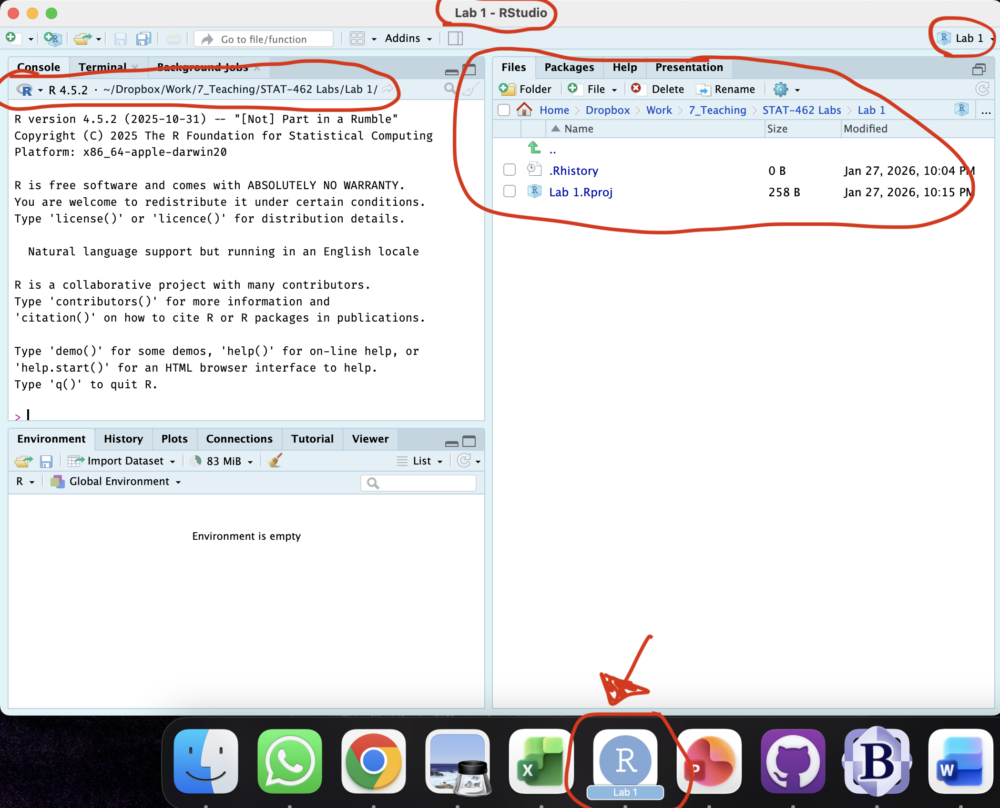
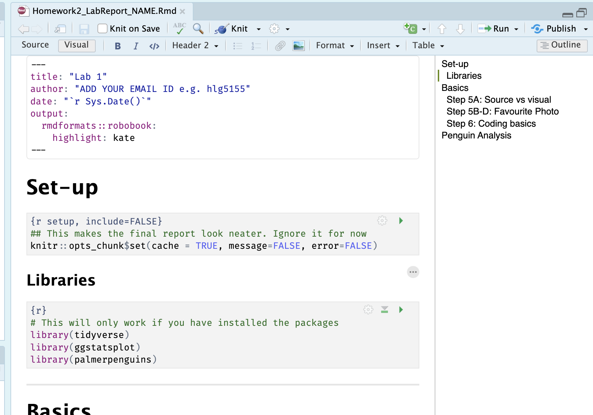

# (PART\*) [.]{style="color: white;"} {.unnumbered}
# (PART\*) **LAB INSTRUCTIONS** {.unnumbered}


# Homework 2 {#Lab_2 .unnumbered}

## LAB AIM {.unnumbered}

Welcome to Homework 2. This is worth 15/20 (the other 10 was for the in-class exercises). Overall each lab is worth 4.8% and you can drop your lowest score. 

This is due the night before your next lab.  The maximum time it should take is about 2-3 hrs of your time.

The aim of this lab is to get comfortable creating your lab reports, and how to edit both text and code. Finally you will get to apply some knowledge from the course so far.

<br><br>

## LAB SET-UP (Important!) {.unnumbered}

You should have already done this from Homeworks 1 and during the Lab 2 class. So for most people this will be a quick check that you completed each item. If not, I have linked the tutorials for you. 

<br>

### STEP 1: Install/update R and R-Studio {.unnumbered}

If you are using R on your computer, you should have installed/updated it last week and should be running R version "4.6.1 (2026-06-24) -- "Happy Hop" (look at the top of the console), and R-Studio version 2026.08.2. (Yellow Yarrow).

**If that's the case (or you're using posit cloud), move to STEP 2** 

If you do need to update, follow these tutorials

-   _**[1A]** First click here to learn more about R, R-Studio and R-Markdown: [What are R and R-Studio](#WhatIsR)_

-   _**[1B a]** If you're not planning to use your own computer, go here to make an account and log into Posit Cloud, which will let you use R online. [Tutorial on Posit Cloud](#Setup_Online)_

-   _**[1B b]** If you are planning to use your own laptop but don't yet have R and R studio, go here to learn how to install them. [Tutorial on Installing R](#Setup_Desktop)_

-   _**[1B c]** if you already have R on your laptop, you probably need to update it! You should be running R version "4.5.2 [Not] Part in a Rumble" (look at the top of the console), and R-Studio version 2026.01.0. (apple blossom). If not, click here to learn more - [Tutorial on Updating R](#Setup_UpdateDesktop)_

<br><br>


### STEP 2: Creating a project.. {#HW2_Step2 .unnumbered}

You should have already made a project for this homework during class today.

 **If you did NOT make a project, complete STEP 2A. Most people can jump to step 2B**
 
 -   **[2A]**  Go here to read more about projects and to make a project for Homework2: [Projects](#T1_Projects)

<br>

**If you DID make a project, complete STEP 2B**

-   **[2B]** Sorry, I realized I got everyone to call their project it Lab1 rather than Homework2! Lets rename the folders to match canvas or everyone will get confused. 

      -   R-studio won't like this, so first, CLOSE R-STUDIO COMPLETELY 
      -   Then go to your GEOG-364 folder and rename the folders Homework2, Homework3, Homework4, Homework5, Homework6.  So this lab (previously called Lab1) is now called Homework2.
      -   Then you can reopen the project by double clicking on the Rproj file
      

<br>

#### QUICK CHECK  {.unnumbered}

-  If you haven't already, open your project in R-Studio. It should look like this, but say Homwork2 rather than Lab1.

<div class="figure">

<p class="caption">(\#fig:L1-Projectcheck)How to check you are in a project</p>
</div>


<br><br>

### STEP 3: Install Packages using the app store.. {.unnumbered}

-   **[3A]** Go to the 'install/app store' and install these three packages. 

    -   `rmdformats`
    
    -   `palmerpenguins`

    -   `tidyverse` # YOU DON'T NEED TO REINSTALL IF YOU DID THIS IN CLASS

    -   `ggstatsplot` # YOU DON'T NEED TO REINSTALL IF YOU DID THIS IN CLASS
    
If you can't remember how, then here are the tutorials: 
 - [About Packages](#T2_Libraries_about), 
 - [Installing Packages](#T2_Libraries_install) We will load and use them later in the lab.


<br><br>


### STEP 4: Download your lab report {.unnumbered}


-   **[4A]** On the canvas assignment, you should see a file called `Homework2_LabReport_NAME.Rmd`. 

-   **[4B]** Download the lab report and PLACE IT IN YOUR PROJECT FOLDER. Rename the file so that instead of "NAME" it's your email ID. For example, for me  `Homework2_LabReport_hlg5155.Rmd`

-   **[4C]** You should be inside your R-project. Open the lab report by clicking on it using the file menu.  The result should look like the screenshot below

-   **[4D]** Change the author at the top then press knit. THIS WILL ONLY WORK IF YOU INSTALLED THE rmdformats PACKAGE IN STEP 3! [Tutorial here](#T32E_Knitting)





<br><br>


### STEP 5: Initial questions {HW2_Step5 .unnumbered}

Under the questions heading, using bullet points and generally neat formatting.. 

-   **[5A]** In the text, state the difference between viewing your lab script using the Source Button vs the Visual Button (try it!) [Tutorial](#T32A_visualmode)

-   **[5B]** Find your favourite photo or screenshot online. SAVE A COPY INTO YOUR HOMEWORK2(LAB1) project folder. Then click Insert picture -> browse and find the picture. Insert it.[Tutorial here](#T32B_formatting)
    
-   **[5C]** Underneath the picture, write why you like it so much/what it means to you. 

-   **[5D]** Press knit and check it still works. IF YOU DIDN'T PUT THE PICTURE IN YOUR HOMEWORK2/LAB1 FOLDER THEN IT MIGHT NOT SHOW UP WHEN YOU PRESS KNIT (even if it shows up on your screen when you insert it)

In fact, the reason you are doing the picture exercise is so that you learn that data/files/photos etc need to go into your project folder..


<br><br>


### STEP 6: R-Coding Questions {.unnumbered}

For those who have programmed in R, these questions are trivial, but use it to get used to the markdown format.  


-   **[6A]** Create a code chunk (either by pressing / on a new line, or by pressing the little green c button at the top of the script). Inside the code chunk

<br>

-   **[6B]** Calculate the sum of 1+1 and assign/save it to the variable 'a' (Like this - you get this one for free). Press the green arrow to run.


``` r
# note, the <- is "< -"  without a space between them
a <- 1+1
a
```

```
## [1] 2
```

-   **[6C]** Calculate the sum of 1+3 and assign it to the variable 'b'
<br>

-   **[6D]** Calculate your age to the power 4 and assign it to a variable called your name (e.g. mine would be `helen <- ...` )

<br>

-   **[6E]** Calculate the sum of a/b and assign it to the variable ans. Then print out `ans` by adding its name (see my example code chunk).

<br>

-   **[6F]** Using the `nchar()` command, calculate the number of characters in the word *"Llanfairpwllgwyngyllgogerychwyrndrobwllllantysiliogogogoch"* . (hint <https://www.educative.io/answers/how-to-calculate-the-size-of-a-string-using-nchar-in-r>, and USE QUOTES)

<br><br>


### STEP 7: Loading the Penguins Data {.unnumbered}

In class we discussed about both numerical and graphical summaries to describe the data.You will be using the `penguins` dataset available in R to make some numerical and graphical summaries.  

-   **[7A]** Find the space in your lab report called Penguin Analysis 

-   **[7C]** At the top of your code, you should have a library code chunk that looks like this.  This will load the `ggstatsplot`, `tidyverse` and `palmerpenguins` packages, making their commands available. 


``` r
library(tidyverse)
library(ggstatsplot)
library(palmerpenguins)
```


-   Run the code chunk by pressing the green arrow. The first time you run it, you might see a load of "friendly loading text". Press the green arrow a second time and it should go away.

<br>

-   **[7C]** The palmer penguins package contains a dataset called penguins. Make a new code chunk under your penguin heading. Inside type this and run the code chunk to load it. In your environment you should see penguins turn up as a "promise"


``` r
data(penguins)
```

<br>

-   **[7D]** Type `?penguins` into the CONSOLE (not into a code chunk) to bring up the help file for the penguins dataset. This contains important information about the data and contents.

<br>

-   **[7E]** Type `View(penguins)` into the CONSOLE (not into a code chunk) and it will open the dataset as a spreadsheet.  

<br><br>


### STEP 8: Penguin analysis {.unnumbered}

-   **[8A]** Using the help file and your analysis of the data, in your report, write as clearly and accurately as you can: 
    - The object of analysis <br>
    - The specific sampling frame the data came from<br>
    - A reasonable larger inferred population, e.g. might results from this extend beyond the specific. Justify why you chose that population.<br>
    - List each variable using a bullet point list, explaining what each one is, including units as available and stating what type of data each one is (e.g. numeric, categorical data etc). Justify your decision! 
    (hint THE EASIEST WAY TO DO THIS IS TO COPY THE VARIABLES FROM THE HELP FILE AND TIDY UP)

<br>

-   **[8B]** Create a code chunk.  Using the examples in [Tutorial on Basic Code](#T4_applyingonecolumn),

    -   Calculate the MEAN of the column flipper_length_mm in the penguins dataset <br>
    -   Calculate the MEDIAN body mass in the penguins dataset
    
         -   Hint 1, you need to spell the column name EXACTLY for it to work, case sensitive,
         -   Hint 3, https://sparkbyexamples.com/r-programming/median-in-r-examples/


<br>


-   **[8C]** There have been MANY excellent tutorials written about this dataset. Each of the tutorials below contain many different plots and analysis.  Take a look then see if you can get ONE analysis working in your lab script. (e.g. one plot or one analysis output, not the entire tutorial!). Explain what you did below the r code and explain what the results tell you about Penguins. 

    -    https://www.r-bloggers.com/2020/07/basic-data-analysis-with-palmerpenguins/
    -    https://allisonhorst.github.io/palmerpenguins/articles/examples.html

<br>


**Congrats! Finished!**


<br><br>

## WHAT TO SUBMIT {.unnumbered}

<br>

### If you are using your own computer {.unnumbered}

Press knit one final time. You will have created two files; a `.Rmd` file containing your code and a `.html` file for viewing your finished document.

Find the html and RmD files in your Lab 1 folder on your computer. Double click the html file to open it in your browser and check it's the one you want to submit.

**You need to submit BOTH of these files on the relevant Canvas assignment page.**

You can also add comments to your submission as needed on the canvas page, or you can message Dr G.

<div class="figure">

<p class="caption">(\#fig:L1-Submit)Find them in your GEOG364 folder on your computer</p>
</div>


<br>

### If you are using Posit Cloud online {.unnumbered}

1.  Press knit one final time. You will have created two files; a `.Rmd` file containing your code and a `.html` file for viewing your finished document.

2.  Go to the files tab an click on the little check-box by the RmD file. Then click the blue "more button" and press export. Save onto your computer.

<div class="figure">

<p class="caption">(\#fig:L1-CloudDownload)How do download the files from PositCloud</p>
</div>

2.  Uncheck the .RmD box and click the box by the html file. Then click the blue "more button" and press export. Save onto your computer.

**You need to submit BOTH of these files on the relevant Canvas assignment page.**

You can also add comments to your submission as needed on the canvas page, or you can message Dr G.

<br>

## CHECK YOUR GRADE! {#CheckGradeL1 .unnumbered}

### RUBRIC {.unnumbered}

This is how you will be graded (plus any in-class components)

15/15: Exceptional! Hard to get! You understood the nuance of all the questions and have a very clear understanding of the concepts.  Your lab book report is easy to read and its easy to find the answers.  

14/15: Thoughtful, accurate, and shows a clear understanding of the concepts, with only very minor errors or omissions.Your lab book report is easy to read and its easy to find the answers.  

12/15: Mostly accurate and shows a good understanding, but with some errors, omissions, or weaker explanations

9/15: Shows some understanding, but several answers are incorrect, incomplete, or unclear

5/15: Any attempt!   A single word or a canvas comment to say hi will get you 5 points even if you haven't attended lab,  because I want to know people who are simply dropping a lab compared to people who are really struggling.


Overall, here is what your lab should correspond to:

<table class=" lightable-classic-2 table table-striped table-hover table-responsive" style='font-family: "Arial Narrow", "Source Sans Pro", sans-serif; margin-left: auto; margin-right: auto; margin-left: auto; margin-right: auto;'>
 <thead>
  <tr>
   <th style="text-align:left;"> POINTS </th>
   <th style="text-align:left;"> Approx grade </th>
   <th style="text-align:left;"> What it means </th>
  </tr>
 </thead>
<tbody>
  <tr>
   <td style="text-align:left;"> 98-100 </td>
   <td style="text-align:left;"> A* </td>
   <td style="text-align:left;"> Exceptional.  Above and beyond.   THIS IS HARD TO GET. </td>
  </tr>
  <tr>
   <td style="text-align:left;"> 93-98 </td>
   <td style="text-align:left;"> A </td>
   <td style="text-align:left;"> Everything asked for with high quality.   Class example </td>
  </tr>
  <tr>
   <td style="text-align:left;"> 85-93 </td>
   <td style="text-align:left;"> B+/A- </td>
   <td style="text-align:left;"> Solid work but the odd  mistake or missing answer in either the code or interpretation </td>
  </tr>
  <tr>
   <td style="text-align:left;"> 70-85 </td>
   <td style="text-align:left;"> B-/B </td>
   <td style="text-align:left;"> Starting to miss entire/questions sections, or multiple larger mistakes. Still a solid attempt.  </td>
  </tr>
  <tr>
   <td style="text-align:left;"> 60-70 </td>
   <td style="text-align:left;"> C/C+ </td>
   <td style="text-align:left;"> It’s clear you tried and learned something.  Just attending labs will get you this much as we can help you get to this stage </td>
  </tr>
  <tr>
   <td style="text-align:left;"> 40-60 </td>
   <td style="text-align:left;"> D </td>
   <td style="text-align:left;"> You submit a single word AND have reached out to Dr G or Aish for help before the deadline (make sure to comment you did this so we can check) </td>
  </tr>
  <tr>
   <td style="text-align:left;"> 30-40 </td>
   <td style="text-align:left;"> F </td>
   <td style="text-align:left;"> You submit a single word…....  ANYTHING..                Think, that's 30-40 marks towards your total…. </td>
  </tr>
  <tr>
   <td style="text-align:left;"> 0+ </td>
   <td style="text-align:left;"> F </td>
   <td style="text-align:left;"> Didn’t submit, or incredibly limited attempt.  </td>
  </tr>
</tbody>
</table>
