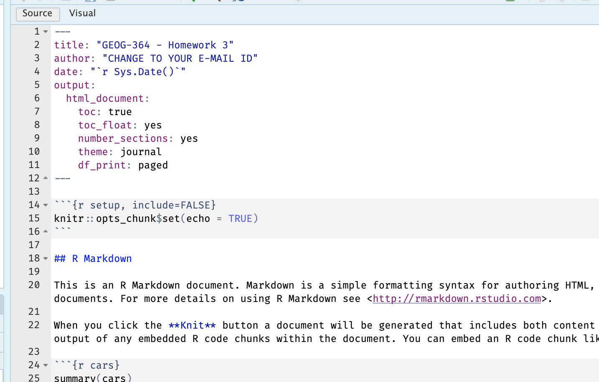

# Project 1 {#Project1 .unnumbered}

### Aim {.unnumbered}

Welcome to Project-1. This is worth 100 points! You can drop your lowest score out of the three projects.

YOU HAVE TWO WEEKS! The maximum time it should take is about 4-6 hrs of your time, plus both lab times.

The aim of this lab is to showcase your spatial analysis. <br>

### Need help?

REMEMBER THAT EVERY TIME YOU RE-OPEN R-STUDIO YOU NEED TO RE-RUN **ALL** YOUR CODE CHUNKS. The easiest way to do this is to press the "Run All" button, in the "Run" menu at the top right of your screen

<br>

<br>

------------------------------------------------------------------------

## PART 1: LAB SET-UP (Important!) {.unnumbered}

### STEP 1: Create your R-project for Project-1 {.unnumbered}

- **[1A]** Make a project for Project-1 (tutorial here) [Projects](#T1_Projects)

- **[1B]** Open your Project-1 R-project in R-Studio (see screenshot below).

<div class="figure">

<p class="caption">(\#fig:L3-Projectcheck)Yours should look like this but say the name of your Project-1 project</p>
</div>

<br>

------------------------------------------------------------------------

### STEP 2: Create your lab report structure & YAML code {.unnumbered}

- **[2A]** Make a new RMarkdown Report ([Tutorial here](#T31_NewMarkdown)) <br>

- **[2B]** As we discussed last week, your YAML code at the top of your script tells R how to make the final report. It lives between the --- lines. CAREFULLY replace the YAML code with this code (remember to only have one set of ---) and press knit.


``` r
---
title: "GEOG-364 - Project-1"
author: "CHANGE TO YOUR E-MAIL ID"
date: "`r Sys.Date()`"
output:
  html_document:
    toc: true
    toc_float: yes
    number_sections: yes
    theme: journal
    df_print: paged
---
```

It should look like this.

<div class="figure">

<p class="caption">(\#fig:L3-YAML)Remember the ---! This is easier in source mode</p>
</div>

<br>

------------------------------------------------------------------------

### STEP 3: Change the theme {.unnumbered}

There are many easy themes you can select to change the look of your report.

- **[3A]** In your YAML code, try changing the theme line to one of these, then press knit to see how it looks (some don't work in some versions of R). YOU DON'T NEED THE QUOTES.

- “bootstrap”, “cerulean”, “cosmo”, “darkly”, “flatly”, “journal”, “lumen”, “paper”, “readable”, “sandstone”, “simplex”, “spacelab”, “united”, “yeti”

- Choose a theme of your choice.

<br>

### STEP 4: Adjust your knit options {.unnumbered}

When you press knit when you have packages, a load of library loading text will appear. This makes it hard to find your answers and makes your labs less professional. Although this was addressed in earlier labs, here's how to fix this issue.

- **[4A]** Look at the first code chunk below the YAML code. The `opts_chunk$set()` command allows us to set general knit options for the entire report.

```         
   knitr::opts_chunk$set(echo = TRUE)
```

- Add in two more options, warning=FALSE and message=FALSE.

```         
   knitr::opts_chunk$set(echo = TRUE, warning=FALSE, message=FALSE)
```

- When you press knit for now, nothing should happen (but no errors. )

<br>

### STEP 5: Tidy up {.unnumbered}

- **[5A]** Delete all "the friendly welcome text", below the knitr::opts_chunk so you have a nice clean report:


<br>

### STEP 6: Finally.. sort out libraries {.unnumbered}

It's good practice to have a single code chunk near the top of the script containing all your library commands. This is to stop duplicated code and to make it easy to see what you are loading before running your labs.

- **[6A]** Add a new code chunk under the opts one, and add the code inside it to load the packages.


``` r
library(tidyverse) # Lots of data processing commands
library(knitr)     # Helps make pretty output files
library(ggplot2)   # Output plots
library(sf)        # Spatial commands
library(tmap)      # Mapping commands
library(readxl)    # Read from excel files
```

- **[6B]** Then press save or try to knit. If any packages are missing you will see

  - EITHER a little yellow bar at the top of the screen asking if you want to install the libraries. Say yes, wait until the libraries are installed and try again. <br>
  - OR an error saying that it can't find that library (it might also be a spelling mistake if you are sure it's installed). In this case, you have to go to the app store and download it (Packages/Install). <br>\

<br><br>

### STEP 7: Check progress {.unnumbered}

- OK - so by now, you should be running the project for Project-1, you have created your lab report, the YAML code works and your libraries work. If not, STOP, go back and redo the tutorials or talk to Dr G/Samrin

<br><br>


## PART 2: IN-CLASS - DATA DETECTIVE (25 MARKS) {.unnumbered}


YOU CAN WORK IN GROUPS

<br>

I recently found two ‘mystery files’ on my computer that I had forgotten to name correctly.

I know they must be from two out of these four experiments:

* **COVID-19 Clusters in Central Pennsylvania**. <br> The local government has asked for help identifying clusters of COVID-19 cases across central PA. The aim is to prioritize mobile testing units and health messaging in affected towns.

* **Mediterranean Vineyard Clusters**. <br> An international agricultural group is funding a study of vineyard clustering in two Mediterranean islands, aiming to evaluate whether specific micro-climates or land use policies are influencing planting decisions.

* **Smooth-Hound Shark Hot-spots**. <br> You are working with the regional fishing board to identify hot-spots for Smooth-Hound Shark activity. The goal is to define seasonal no-fishing zones to support sustainable stock management. The data represents tagged shark locations in the last month.

* **Polar Bear Cluster Study in the Arctic**. <br> PSU ecologists are investigating polar bear movement patterns across the Arctic. Using GPS collar data, they are analyzing seasonal hot-spots for foraging and denning, particularly in response to changing sea ice patterns.

<br>

1. Check your setup

* If you haven't already, GO AND DO THE SET-UP SECTION. You should now have your project running, your Project 1 report open, and your library code chunk run.

<br>

2. Read in the data

* Create a heading called **Mystery Data**.
* Create a code chunk and use the `st_read()` command to read each dataset into R. Remember the tutorials on the left (spatial basics or see your last lab)


<br>

3. Map the data

* In your lab report, explore and map the data. New mapping tutorial at the end!  You can also check this online guide: [https://r-tmap.github.io/tmap-book/layers.html](https://r-tmap.github.io/tmap-book/layers.html)

<br>

4. Match the data to the experiment

* Using your maps, work out which experiment each dataset matches (see the exercise intro).
* Explain your reasoning in your report, providing common-sense evidence to support your explanation of the non-uniformity of space.
  *Hint: this isn't meant to be a trick – it should be fairly straightforward.*

<br>

5. Choose an appropriate spatial domain

* For **each** of your two chosen scenarios, describe what you think would be a good spatial domain (study area) **given the aim of the research project at the start of the question!**.
* Consider both the geography and the research question: What area makes sense to include? What might be too broad or too narrow? Does the non uniformity of space, locational fallacy or edge effects impact your choice. Does your domain have "holes" or is it a solid shape? 
* Then describe in words whether the points in your dataset seem **clustered**, **dispersed**, or **uniformly** distributed given your domain.
* Explain your reasoning in your own words.


## PART 3: MAIN PROJECT {.unnumbered}

In this lab, you will work with wildfire occurrence data from Santa Cruz County, California. You will start with an Excel spreadsheet containing fire locations and attributes, convert it to spatial `sf` data, explore the spatial pattern of fires, and aggregate the fire locations to census tracts.

**Will be updated for the second part of the lab**. This time it's on purpose! I want you to really think about the discussion questions above. 


**Congrats! Finished!**

<br><br>

## WHAT TO SUBMIT {.unnumbered}

<br>

### If you are using your own computer {.unnumbered}

Press knit one final time. You will have created two files; a `.Rmd` file containing your code and a `.html` file for viewing your finished document.

Find the html and RmD files in your Lab 1 folder on your computer. Double click the html file to open it in your browser and check it's the one you want to submit.

**You need to submit BOTH of these files on the relevant Canvas assignment page.**

You can also add comments to your submission as needed on the canvas page, or you can message Dr G.

<div class="figure">

<p class="caption">(\#fig:L1-Submit)Find them in your GEOG364 folder on your computer</p>
</div>

<br>

### If you are using Posit Cloud online {.unnumbered}

1.  Press knit one final time. You will have created two files; a `.Rmd` file containing your code and a `.html` file for viewing your finished document.

2.  Go to the files tab an click on the little check-box by the RmD file. Then click the blue "more button" and press export. Save onto your computer.

<div class="figure">

<p class="caption">(\#fig:L1-CloudDownload)How do download the files from PositCloud</p>
</div>

2.  Uncheck the .RmD box and click the box by the html file. Then click the blue "more button" and press export. Save onto your computer.

**You need to submit BOTH of these files on the relevant Canvas assignment page.**

You can also add comments to your submission as needed on the canvas page, or you can message Dr G.

<br>

## CHECK YOUR GRADE! {#CheckGradeP1 .unnumbered}

### RUBRIC {.unnumbered}

This is how you will be graded (plus any in-class components)

25/25: You made a good effort and answered all the questions. If you came to the lab, there's probably about 10-15 mins additional work. CHECK EACH PART OF QUESTION 10 AND 11.

15/25: You attempted most of the lab and explained where you got stuck.

5/15: Any attempt! A single word or a canvas comment to say hi will get you 5 points even if you haven't attended lab, because I want to know people who are simply dropping a lab compared to people who are really struggling.
