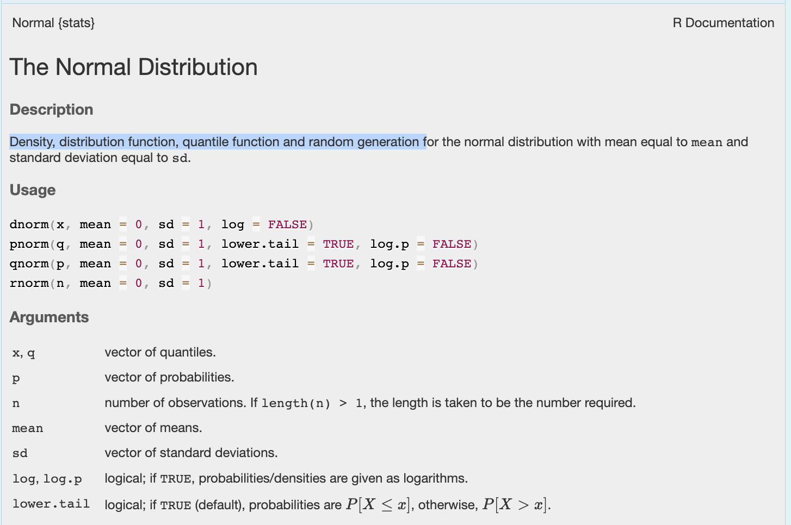

``` r
# OPTIONS -----------------------------------------------
knitr::opts_chunk$set(echo = TRUE, 
                      warning=FALSE, 
                      message = FALSE)

# Tutorial packages
library(vembedr)
library(skimr)
library(yarrr)
```

```
## Loading required package: jpeg
```

```
## Loading required package: BayesFactor
```

```
## Loading required package: coda
```

```
## Loading required package: Matrix
```

```
## ************
## Welcome to BayesFactor 0.9.12-4.8. If you have questions, please contact Richard Morey (richarddmorey@gmail.com).
## 
## Type BFManual() to open the manual.
## ************
```

```
## Loading required package: circlize
```

```
## ========================================
## circlize version 0.4.18
## CRAN page: https://cran.r-project.org/package=circlize
## Github page: https://github.com/jokergoo/circlize
## Documentation: https://jokergoo.github.io/circlize_book/book/
## 
## If you use it in published research, please cite:
## Gu, Z. circlize implements and enhances circular visualization
##   in R. Bioinformatics 2014.
## 
## This message can be suppressed by:
##   suppressPackageStartupMessages(library(circlize))
## ========================================
```

``` r
library(RColorBrewer)
library(GGally) 
```

```
## Loading required package: ggplot2
```

```
## 
## Attaching package: 'ggplot2'
```

```
## The following object is masked from 'package:yarrr':
## 
##     diamonds
```

``` r
library(tidyverse)
```

```
## ── Attaching core tidyverse packages ──────────────────────── tidyverse 2.0.0 ──
## ✔ dplyr     1.2.1     ✔ readr     2.2.0
## ✔ forcats   1.0.1     ✔ stringr   1.6.0
## ✔ lubridate 1.9.5     ✔ tibble    3.3.1
## ✔ purrr     1.2.2     ✔ tidyr     1.3.2
```

```
## ── Conflicts ────────────────────────────────────────── tidyverse_conflicts() ──
## ✖ tidyr::expand()  masks Matrix::expand()
## ✖ dplyr::filter()  masks stats::filter()
## ✖ lubridate::hms() masks vembedr::hms()
## ✖ dplyr::lag()     masks stats::lag()
## ✖ tidyr::pack()    masks Matrix::pack()
## ✖ tidyr::unpack()  masks Matrix::unpack()
## ℹ Use the conflicted package (<http://conflicted.r-lib.org/>) to force all conflicts to become errors
```

``` r
library(plotly)
```

```
## 
## Attaching package: 'plotly'
## 
## The following object is masked from 'package:ggplot2':
## 
##     last_plot
## 
## The following object is masked from 'package:stats':
## 
##     filter
## 
## The following object is masked from 'package:graphics':
## 
##     layout
```

``` r
library(readxl)
library(rvest)
```

```
## 
## Attaching package: 'rvest'
## 
## The following object is masked from 'package:readr':
## 
##     guess_encoding
```

``` r
library(biscale)
library(tidycensus)
library(cowplot)
```

```
## 
## Attaching package: 'cowplot'
## 
## The following object is masked from 'package:lubridate':
## 
##     stamp
```

``` r
library(units)
```

```
## udunits database from /Library/Frameworks/R.framework/Versions/4.6-x86_64/Resources/library/units/share/udunits/udunits2.xml
```

# Coding {#T4_Coding}

## Quick reminder

```         
mean()                 FUNCTION: something R does

mean(mpg$year)         ARGUMENT: tell the function what to use

Sys.Date()             SPECIAL CASE: a function that needs no argument

mpg$year               $: choose a column by name

mpg[2, 3]              [row, column]: choose data by position

mean_year <- mean(...) <- : save the result

?mean                  ?: open the help file
```

These few pieces of syntax will appear again and again throughout the course.

<br>

## Functions / Commands

Commands, often called **functions**, are the verbs of "speaking R". They are actions: things you want R to *do*.

Three useful things to know:

- Functions have parentheses `( )` after their name. This is one way to recognise that something is a function.

- Most functions need some information from you. This information goes **inside** the parentheses.

- You can look at the help file for a function by typing `?` followed by its name into the **Console**, for example `?mean`.

You can also search for functions in the **Help** tab in RStudio.

<br>

## Giving information to a function: arguments

Most commands need some information from you, which you put inside the parentheses `( )`. These are called arguments. You separate them with a comma and you can find out whats available using the help file.

For example, the `round()` function tells R to round numbers to a pre-specified number of decimal places.


``` r
round(1.6722615, digits=3)
```

```
## [1] 1.672
```

Here we have told R to round the number 1.6722615 to three decimal places:

- `round()` is the command/function.

- `1.6722615` is the first argument, the number we want to round.

- `digits = 3` is the second argument; we want to round to three decimal places

As a second example


``` r
rnorm(n = 5, mean = 10, sd = 2)
```

```
## [1] 10.198402 11.741009 11.708219 10.313859  9.637222
```

Here we have told R: to randomly select `5` values from a normal distribution that has a mean of `10`, and a standard deviation of `2`.

- The command/function is `rnorm`()\`

- The arguments are `n=5` (the number of values we want), then `mean=10` and `sd=2`, the mean and standard distribition of the normal distribution to extract the values from.

<br>

### Working out the arguments

All R commands have a help file, some more complex than others! This always tells you the name and purpose of the command, then has a list of variables (and the default value if you choose to not type anything). Sometimes it also adds in several related commands into one help file.

For example, take a look at the rnorm help file by typing its name into the console with a ? in front.


``` r
?rnorm
```

You should see this. Exactly what the commands do is often hidden in the description! In this case you can see that

- `dnorm()` calculates the density of the Normal Distribution (e.g. it draws the shape of it)
- `pnorm()` calculates the probability distribution function of the Normal Distribution
- `qnorm()` calculates the quantiles of the Normal Distribution
- `rnorm()` randomly generates numbers from the Normal Distribution

In all cases, the command assumes that the mean is 0 and the standard deviation is 1. ChatGPT/Claude can help you interpret these!



<br>

### A special case: functions with empty `( )`

Some functions don't need any extra information from you. These are a special case where the parentheses can be left empty. Even though there is nothing inside the parentheses, **you still need the `( )`** because these are functions.

For example, try typing these exactly into your console


``` r
Sys.Date()
getwd()
file.choose()
```

- `Sys.Date()` tells you today's date.

- `getwd()` tells you the folder R is currently working in.

- `file.choose()` is interactive! It opens a window allowing you to choose a file, then writes out its location on your computer.

<br>

## Stacking commands

You can put commands inside of commands! It starts from the inside and works out. For example,

- This FIRST generates 5 numbers from a normal distribution with mean=10 and sd=2.

- THEN it rounds each of those 5 numbers to 3 decimal places


``` r
round(rnorm(n = 5, mean = 10, sd = 2), digits=3)
```

```
## [1] 10.224 10.448 10.404  8.258 14.055
```

<br>

## Referring to a column using `$`

Often we don't want to apply a command to an entire spreadsheet. We want to use just **one column**.

The easiest way to refer to a column is:

```         
dataset$column
```

For example:

```         
mpg$year
```

means:

> "the `year` column inside the `mpg` dataset"

We can then apply functions to that column:

```         
mean(mpg$year)

median(mpg$year)

summary(mpg$year)
```

If there are missing values, many summary functions allow:

```         
mean(mpg$year, na.rm = TRUE)
```

**Column names are case-sensitive and need to be spelled exactly.** If you're not sure what a column is called, use:

```         
names(mpg)
```

<br>

## Saving your results using `<-`

So far, most of our commands have simply printed an answer.

If you want to **save** the result so you can use it again, use the assignment arrow. You can type this with the \< symbol then the - symbol (it might magically change into an arrow or not, its fine either way)

```         
<-
```

For example:

```         
mean_year <- mean(mpg$year)
```

This means:

> calculate the mean of `mpg$year` and save the answer as `mean_year`.

You can then type:

```         
mean_year
```

to see the saved value.

You can choose your own sensible names for things you create:

```         
average_year <- mean(mpg$year)

random_numbers <- rnorm(20)
```

You will use `<-` constantly in R to save datasets, results, models and plots.

<br>
