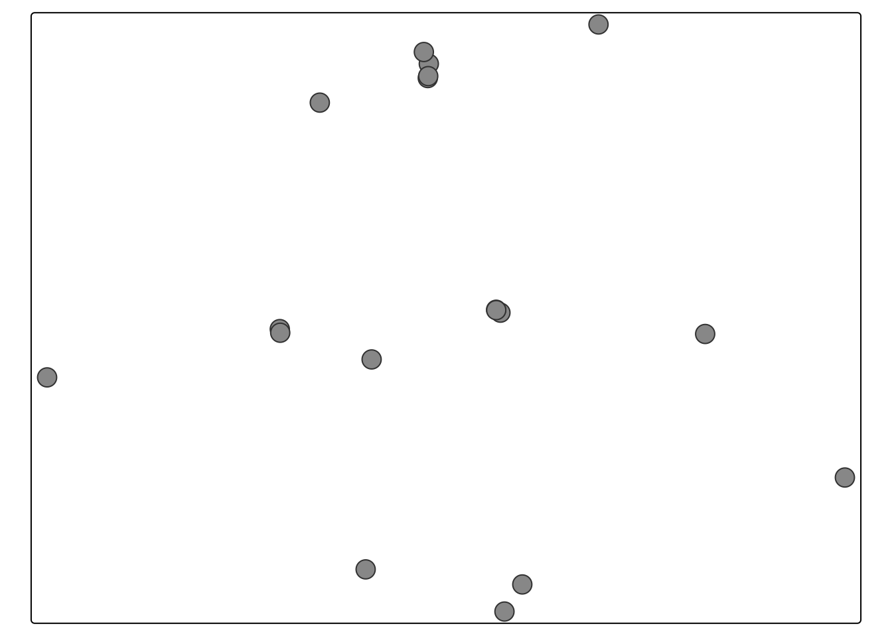
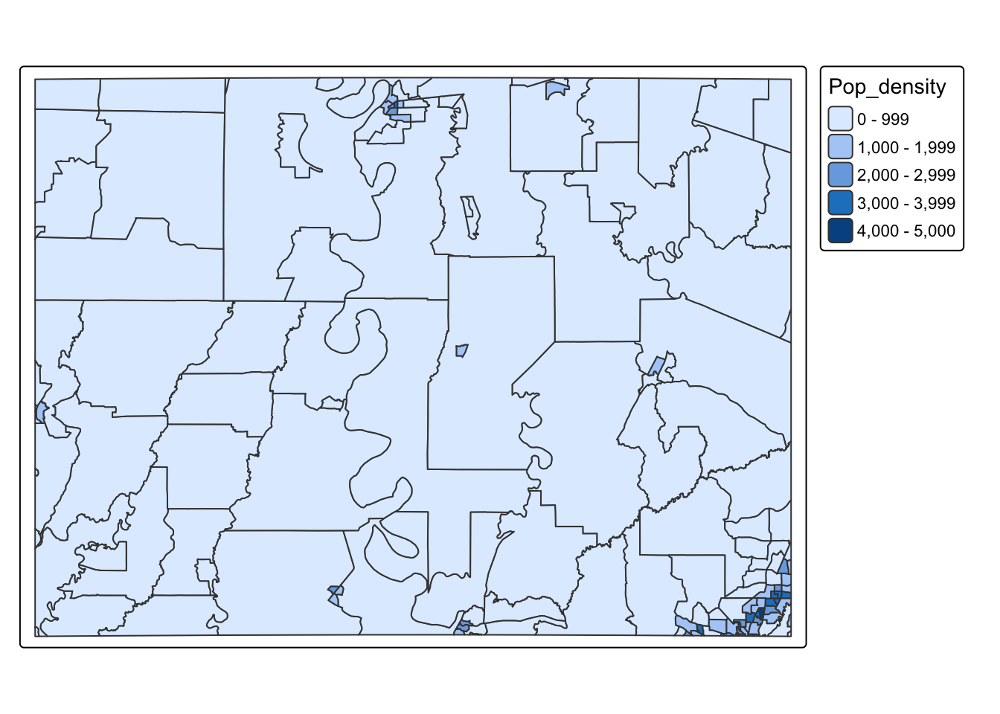

# Spatial data {#T5_VectorSpatial}

<br>

## Example datasets

Throughout this tutorial, I will be using a dataset of medical clinics. You are welcome to download it yourself if you want to follow along by clicking here.

- Medical clinics: MedicalClinics.xlsx
- Population Density: medical_population.gpkg
- Broadband: medical_broadband.zip

## Useful tutorials

- <https://ourcodingclub.github.io/tutorials/spatial-vector-sf/>
- <https://github.com/rstudio/cheatsheets/blob/main/sf.pdf>
- <https://learning.nceas.ucsb.edu/2020-02-RRCourse/spatial-vector-analysis-using-sf.html>

<br>

## Spatial data basics {#T5_WhatIsSpatial}

Geographical data needs special treatment. As well as standard data analysis, we need to tell R that our data has a spatial location on the Earth's surface. R needs to understand what units our spatial location is in (e.g. metres, degrees..) and how we want the data to appear on plots and maps. R also needs to understand the different types of vector data (e.g. what we mean by a "polygon" or "point").

To achieve this there are some specialist types of data we need to use and several spatial data packages.

1.  **Vector data mostly uses the `sf` package**. Each object (row) is represented as a spatial object (a point, line or polygon). For example the locations of trees might be represented as points, a road network as lines, and building footprints as polygons.

2.  **Raster data mostly uses the `terra` package** The spatial domain is divided into a grid of equally sized cells. These are useful for storing field data that varies continuously over space, such as a satellite image, temperature or an elevation surface.

We're going to split this tutorial by vector and raster (field) data

<br>

### Map projections

See here for a great overview: <https://source.opennews.org/articles/choosing-right-map-projection/>

At its simplest, think of our map projections as the "units" of the x-y-z coordinates of geographic data. For example, here is the same map, but in two different projections.

- On the left, the figure is in latitiude/longitude in units of degrees. LOOK AT THE UNITS ON THE AXIS!

- On the right the same map is in UTM.

<div class="figure" style="text-align: center">

<p class="caption">(\#fig:Tut11Fig1)*Examples of geographic coordinate systems for raster data (WGS 84; left, in Lon/Lat degrees) and projected (NAD83 / UTM zone 12N; right, in metres), figure from https://geocompr.robinlovelace.net/spatial-class.html*</p>
</div>

#### The UTM system

In the UTM system, the Earth is divided into 60 zones. Northing values are given by the metres north, or south (in the southern hemisphere) of the equator. Easting values are established as the number of metres from the central meridian of a zone. You can see the UTM zone here

<div class="figure" style="text-align: center">

<p class="caption">(\#fig:Tut11Fig2)Zone 12N: https://epsg.io/32612</p>
</div>

#### EPSG codes

Each map projection has a unique numeric code called an EPSG code. To find them, I tend to use these resources, but in this course I will try to provide the codes

- <https://epsg.io>
- <https://mangomap.com/robertyoung/maps/69585/what-utm-zone-am-i-in->
- ChatGPT and similar

<p class="comment">

**R is stupid. It has no idea what units or projection your coordinates are in until you tell it**

</p>

<br><br>

## Vector Data {#T5_sfobjects}

### How to make existing data "spatial" (`st_as_sf`) {#T5_st_as_sf}

The `sf` package is designed to deal with vector data, but you need to convert your data into `sf` format before its commands will work. Lets read in some non spatial data. These are medical clinics near the LA/MI border.


``` r
medicaldata <- read_excel("MedicalClinics.xlsx")
head(medicaldata)
```

```
## # A tibble: 6 × 4
##   Longggitude latitudE Name                            Description
##         <dbl>    <dbl> <chr>                           <chr>      
## 1       -91.2     32.4 Madison Parish Hospital         Hospital   
## 2       -91.4     32.9 West Carroll Memorial Hospital  Hospital   
## 3       -91.3     33.3 Chicot Memorial Medical Center  Hospital   
## 4       -91.9     32.8 Morehouse General Hospital      Hospital   
## 5       -90.8     32.4 Merit Health River Region       Hospital   
## 6       -90.6     33.5 South Sunflower County Hospital Hospital
```

#### Step 1: Note the column names of your x/y coordinates {.unnumbered}

First, look at your data and note the column names of your x and y coordinates. Note, these don’t have to be fancy spatial names, they can be “elephanT” and “popcorn”. To make my point, I have named my x and y columns "Longggitude" and "latitudE".

You can do this via looking at just the column names with the names command


``` r
names(medicaldata)
```

```
## [1] "Longggitude" "latitudE"    "Name"        "Description"
```

or by just looking at the data


``` r
medicaldata
```

```
## # A tibble: 18 × 4
##    Longggitude latitudE Name                                       Description
##          <dbl>    <dbl> <chr>                                      <chr>      
##  1       -91.2     32.4 Madison Parish Hospital                    Hospital   
##  2       -91.4     32.9 West Carroll Memorial Hospital             Hospital   
##  3       -91.3     33.3 Chicot Memorial Medical Center             Hospital   
##  4       -91.9     32.8 Morehouse General Hospital                 Hospital   
##  5       -90.8     32.4 Merit Health River Region                  Hospital   
##  6       -90.6     33.5 South Sunflower County Hospital            Hospital   
##  7       -90.9     32.9 Sharkey Issaquena Community Hospital       Hospital   
##  8       -91.0     33.4 Family Medical Center                      Clinic     
##  9       -91.4     32.9 Oak Grove Medical Clinic                   Clinic     
## 10       -90.4     32.9 Baptist Medical Group - Yazoo Primary Care Hospital   
## 11       -90.1     32.6 UMMC Madison Hospital                      Hospital   
## 12       -90.9     32.3 Medical Associates of Vicksburg            Clinic     
## 13       -90.9     32.9 Rolling Fork Medical Clinic                Clinic     
## 14       -91.2     32.8 Lake Providence Medical Clinic             Clinic     
## 15       -91.0     33.4 Delta Health Center                        Clinic     
## 16       -91.1     33.4 Delta Regional Health Clinic               Clinic     
## 17       -91.0     33.4 United Medical Inc                         Clinic     
## 18       -90.9     32.9 Jackson Rural Health Clinic                Clinic
```

<br>

#### Step 2: Note the coordinate reference system {.unnumbered}

Spatial data also needs a **Coordinate Reference System (CRS)**. The CRS tells R what the coordinates mean and how they relate to locations in your domain. For example, the coordinates might be longitude/latitude in degrees, or projected x/y coordinates measured in metres.

Each of these many thousands of coordinate systems has an "EPSG" reference number assigned to it, and we need that to communicate to R in order to correctly make the data spatial.

[In this class, we are mostly going to be longitude/latitude data in units of degrees with EPSG=4326]{.underline}

But as long as you can identify it, you can work with any form of spatial data. The problem is that you need to note the coordinate system in advance from the help-file/data-documentation. These days, if you have some idea then asking chatGPT/Claude for the related EPSG code will be the fastest way to get it, but there are also many websites that can help such as <https://epsg.io>

<br>

#### Step 3: Make the data spatial {.unnumbered}

Now we have everything needed to make our data spatial.


``` r
medicaldata_sf <- st_as_sf(medicaldata, 
                           coords=c("Longggitude","latitudE"),
                           crs=4326)
```

In this code:

- **Command:**

  - st_as_sf() from the sf package. It will only work if you have the sf package in your library loading chunk and if you have run that code chunk.

- **Arguments**

  - `medicaldata` is the original table.

  - `coords = c("Longggitude", "latitudE")` tells R the COLUMN NAMES of the **x and y coordinates**. Longitude is x, so it comes first. Latitude is y, so it comes second.

  - coords: These are the COLUMN NAMES of our coordinates. In this case, they are are "Longggitude" and "latitudE" (note the c() and the quote marks)

  - `crs = 4326` tells R what coordinate system those numbers are already using. EPSG:4326 is WGS 84 longitude/latitude.

  - `medicaldata_sf` I tend to name the spatial version the same as the original data but add \_sf at the end.

<br><br>

------------------------------------------------------------------------

### Reading spatial data from file — `st_read()` {#T5_st_read}

There are also many spatial files. Common examples include shapefiles (`.shp`), GeoJSON files (`.geojson`) and GeoPackages (`.gpkg`). In this case the geometry is already stored in the file, so you do **not** need `st_as_sf()`.

To read in spatial files, use the `st_read()` command. This is easy for gpkg and geoson files.


``` r
population_sf <- st_read("medical_population_density.gpkg")
```

```
## Reading layer `acs_pop_density' from data source 
##   `/Users/hgreatrex/Documents/GitHub/Teaching/GEOG-364/Geog364-2026/medical_population_density.gpkg' 
##   using driver `GPKG'
## Simple feature collection with 156 features and 5 fields
## Geometry type: MULTIPOLYGON
## Dimension:     XY
## Bounding box:  xmin: -91.91738 ymin: 32.32208 xmax: -90.08308 ymax: 33.46097
## Geodetic CRS:  NAD83
```

#### Reading in shapefiles

**IMPORTANT**: Shapefiles (.shp) are actually made up of several separate files (for example, .shp, .shx, and .dbf). Keep all of these files together in the same folder, or the shapefile will not open correctly.

You will have downloaded a zipped folder (medical_broadband.zip). Unzip this, but keep all of the shapefile components together in the same folder.


```
## [1] "medical_broadband.dbf" "medical_broadband.prj" "medical_broadband.shp"
## [4] "medical_broadband.shx"
```

To read the shapefile into R, point st_read() to the .shp file: R will automatically use the other shapefile components stored alongside it.


``` r
broadband_sf <- st_read("medical_broadband/medical_broadband.shp")
```

```
## Reading layer `medical_broadband' from data source 
##   `/Users/hgreatrex/Documents/GitHub/Teaching/GEOG-364/Geog364-2026/medical_broadband/medical_broadband.shp' 
##   using driver `ESRI Shapefile'
## Simple feature collection with 156 features and 6 fields
## Geometry type: MULTIPOLYGON
## Dimension:     XY
## Bounding box:  xmin: -91.91738 ymin: 32.32208 xmax: -90.08308 ymax: 33.46097
## Geodetic CRS:  NAD83
```

<br><br>

### Exploring vector data {#T5_sfexplore}


No matter if you have read the data in from file or converted it, your spatial dataset will appear different to a normal table.

In general, a `sf` object behaves very much like an ordinary data frame: each row is one object and the ordinary columns contain its variables. The difference is that an `sf` object also has a special `geometry column` which stores the spatial information for each row. It also contains meta data about the coordinate system and the bounding box/spatial domain.

For example, a point dataset might conceptually look like this:

| Name | Height | Number of leaves | geometry    |
|------|--------|------------------|-------------|
| A    | 21.3   | 350              | POINT (...) |
| B    | 19.8   | 510              | POINT (...) |
| C    | 22.1   | 280              | POINT (...) |

The first three columns are ordinary variables. The `geometry` column tells R where each station is located. For lines and polygons, the geometry column will also contain information about direction and shape.

Here's how the medical data has changed. R now understands that it's spatial,so typing its name it provides a spatial summary alongside the data itself. This includes things like the bounding box and map projection.

Here is our point data.


``` r
medicaldata_sf
```

```
## Simple feature collection with 18 features and 2 fields
## Geometry type: POINT
## Dimension:     XY
## Bounding box:  xmin: -91.91738 ymin: 32.32208 xmax: -90.08308 ymax: 33.4576
## Geodetic CRS:  WGS 84
## # A tibble: 18 × 3
##    Name                                    Description             geometry
##  * <chr>                                   <chr>                <POINT [°]>
##  1 Madison Parish Hospital                 Hospital    (-91.18497 32.40362)
##  2 West Carroll Memorial Hospital          Hospital    (-91.38239 32.86837)
##  3 Chicot Memorial Medical Center          Hospital    (-91.29039 33.30641)
##  4 Morehouse General Hospital              Hospital    (-91.91738 32.77498)
##  5 Merit Health River Region               Hospital    (-90.82479 32.37449)
##  6 South Sunflower County Hospital         Hospital     (-90.64957 33.4576)
##  7 Sharkey Issaquena Community Hospital    Hospital    (-90.87507 32.90016)
##  8 Family Medical Center                   Clinic      (-91.03973 33.38151)
##  9 Oak Grove Medical Clinic                Clinic      (-91.38139 32.86133)
## 10 Baptist Medical Group - Yazoo Primary … Hospital    (-90.40434 32.85895)
## 11 UMMC Madison Hospital                   Hospital    (-90.08308 32.58133)
## 12 Medical Associates of Vicksburg         Clinic      (-90.86579 32.32208)
## 13 Rolling Fork Medical Clinic             Clinic       (-90.88494 32.9058)
## 14 Lake Providence Medical Clinic          Clinic      (-91.17124 32.80971)
## 15 Delta Health Center                     Clinic      (-91.04208 33.35394)
## 16 Delta Regional Health Clinic            Clinic      (-91.05115 33.40433)
## 17 United Medical Inc                      Clinic       (-91.0411 33.35769)
## 18 Jackson Rural Health Clinic             Clinic      (-90.88474 32.90506)
```

and here is our polygon data for population density


``` r
population_sf
```

```
## Simple feature collection with 156 features and 5 fields
## Geometry type: MULTIPOLYGON
## Dimension:     XY
## Bounding box:  xmin: -91.91738 ymin: 32.32208 xmax: -90.08308 ymax: 33.46097
## Geodetic CRS:  NAD83
## First 10 features:
##          GEOID                Name     State Population Pop_density
## 1  22065960200      Madison Parish Louisiana       2359    5.305680
## 2  22083970600     Richland Parish Louisiana       4521   24.553315
## 3  22065960100      Madison Parish Louisiana       1614    9.172155
## 4  22067950600    Morehouse Parish Louisiana       2597   14.511767
## 5  22083970400     Richland Parish Louisiana       3336   24.487161
## 6  22065960500      Madison Parish Louisiana       1983 1451.136487
## 7  22067950100    Morehouse Parish Louisiana       1282    4.691311
## 8  22035000100 East Carroll Parish Louisiana       2377   18.396992
## 9  22035000300 East Carroll Parish Louisiana       1960  504.830911
## 10 22067950800    Morehouse Parish Louisiana       3427  972.502707
##                              geom
## 1  MULTIPOLYGON (((-91.13204 3...
## 2  MULTIPOLYGON (((-91.76072 3...
## 3  MULTIPOLYGON (((-90.90109 3...
## 4  MULTIPOLYGON (((-91.91035 3...
## 5  MULTIPOLYGON (((-91.91738 3...
## 6  MULTIPOLYGON (((-91.20573 3...
## 7  MULTIPOLYGON (((-91.86088 3...
## 8  MULTIPOLYGON (((-91.34755 3...
## 9  MULTIPOLYGON (((-91.22745 3...
## 10 MULTIPOLYGON (((-91.91738 3...
```

You can also ask directly for the geometry type or the details of the map projection. In the example above I would type


``` r
st_geometry(medicaldata_sf)
```

```
## Geometry set for 18 features 
## Geometry type: POINT
## Dimension:     XY
## Bounding box:  xmin: -91.91738 ymin: 32.32208 xmax: -90.08308 ymax: 33.4576
## Geodetic CRS:  WGS 84
## First 5 geometries:
```

and


``` r
# This is what the EPSG=4326 actually means. 
st_crs(medicaldata_sf)
```

<br>

### Keeping the long/lat/coordinate columns

By default, the original longitude and latitude columns have disappeared and been replaced by a `geometry` column. The coordinates have not been lost: they are now stored inside each point geometry.

If you want to keep the original coordinate columns as well, add `remove = FALSE`:


``` r
medicaldata_sf <- st_as_sf(medicaldata, 
                           coords=c("Longggitude","latitudE"),
                           crs=4326,
                           remove = FALSE)


medicaldata_sf
```

```
## Simple feature collection with 18 features and 4 fields
## Geometry type: POINT
## Dimension:     XY
## Bounding box:  xmin: -91.91738 ymin: 32.32208 xmax: -90.08308 ymax: 33.4576
## Geodetic CRS:  WGS 84
## # A tibble: 18 × 5
##    Longggitude latitudE Name               Description             geometry
##  *       <dbl>    <dbl> <chr>              <chr>                <POINT [°]>
##  1       -91.2     32.4 Madison Parish Ho… Hospital    (-91.18497 32.40362)
##  2       -91.4     32.9 West Carroll Memo… Hospital    (-91.38239 32.86837)
##  3       -91.3     33.3 Chicot Memorial M… Hospital    (-91.29039 33.30641)
##  4       -91.9     32.8 Morehouse General… Hospital    (-91.91738 32.77498)
##  5       -90.8     32.4 Merit Health Rive… Hospital    (-90.82479 32.37449)
##  6       -90.6     33.5 South Sunflower C… Hospital     (-90.64957 33.4576)
##  7       -90.9     32.9 Sharkey Issaquena… Hospital    (-90.87507 32.90016)
##  8       -91.0     33.4 Family Medical Ce… Clinic      (-91.03973 33.38151)
##  9       -91.4     32.9 Oak Grove Medical… Clinic      (-91.38139 32.86133)
## 10       -90.4     32.9 Baptist Medical G… Hospital    (-90.40434 32.85895)
## 11       -90.1     32.6 UMMC Madison Hosp… Hospital    (-90.08308 32.58133)
## 12       -90.9     32.3 Medical Associate… Clinic      (-90.86579 32.32208)
## 13       -90.9     32.9 Rolling Fork Medi… Clinic       (-90.88494 32.9058)
## 14       -91.2     32.8 Lake Providence M… Clinic      (-91.17124 32.80971)
## 15       -91.0     33.4 Delta Health Cent… Clinic      (-91.04208 33.35394)
## 16       -91.1     33.4 Delta Regional He… Clinic      (-91.05115 33.40433)
## 17       -91.0     33.4 United Medical Inc Clinic       (-91.0411 33.35769)
## 18       -90.9     32.9 Jackson Rural Hea… Clinic      (-90.88474 32.90506)
```

<br><br>

## Making basic maps (qtm) {#T5_qtmmaps}

You can do this by using the qtm command. "quick thematic map". It's in the tmap package so you need that loaded in your top code chunk before this will work. 

To make a quick map of a spatial dataset, all I do is say qtm(DataName). For example for the medical data:


``` r
qtm(medicaldata_sf)
```




I can then add to this by adding a column title and it will color the dots/polygons by that column. For example, lets say I wanted to look at the population density column of population_sf


``` r
qtm(population_sf, "Pop_density")
```




Even more interestingly, you can make the map interactive by adding tmap_mode("view") before the qtm code. In this mode, someone can change the basemap and zoom in and out.


``` r
tmap_mode("view")
qtm(medicaldata_sf,"Description" )
```

```{=html}
<style>#legend01 { background: #FFFFFF; opacity: 1}</style>
<div class="leaflet html-widget html-fill-item" id="htmlwidget-0d5e9d0c9ca8e99f4144" style="width:672px;height:480px;"></div>
<script type="application/json" data-for="htmlwidget-0d5e9d0c9ca8e99f4144">{"x":{"options":{"crs":{"crsClass":"L.CRS.EPSG3857","code":null,"proj4def":null,"projectedBounds":null,"options":{}},"attributionControl":true},"calls":[{"method":"createMapPane","args":["tmap403",403]},{"method":"addLayersControl","args":[["Esri.WorldGrayCanvas","OpenStreetMap","Esri.WorldTopoMap"],"medicaldata_sf",{"collapsed":true,"autoZIndex":true,"position":"topleft"}]},{"method":"addProviderTiles","args":["Esri.WorldGrayCanvas",null,"Esri.WorldGrayCanvas",{"minZoom":0,"maxZoom":18,"maxNativeZoom":17,"tileSize":256,"subdomains":"abc","errorTileUrl":"","tms":false,"noWrap":false,"zoomOffset":0,"zoomReverse":false,"opacity":1,"zIndex":1,"detectRetina":false,"pane":"tilePane"}]},{"method":"addProviderTiles","args":["OpenStreetMap",null,"OpenStreetMap",{"minZoom":0,"maxZoom":18,"maxNativeZoom":17,"tileSize":256,"subdomains":"abc","errorTileUrl":"","tms":false,"noWrap":false,"zoomOffset":0,"zoomReverse":false,"opacity":1,"zIndex":1,"detectRetina":false,"pane":"tilePane"}]},{"method":"addProviderTiles","args":["Esri.WorldTopoMap",null,"Esri.WorldTopoMap",{"minZoom":0,"maxZoom":18,"maxNativeZoom":17,"tileSize":256,"subdomains":"abc","errorTileUrl":"","tms":false,"noWrap":false,"zoomOffset":0,"zoomReverse":false,"opacity":1,"zIndex":1,"detectRetina":false,"pane":"tilePane"}]},{"method":"addCircleMarkers","args":[[32.4036198,32.8683681,33.3064148,32.774979,32.3744933,33.4576013,32.9001632,33.381512,32.8613319,32.8589459,32.5813311,32.3220803,32.9057951,32.8097065,33.3539375,33.4043276,33.3576853,32.9050568],[-91.18496639999999,-91.3823879,-91.2903886,-91.91738459999991,-90.82479359999989,-90.6495666,-90.87507119999999,-91.03973309999991,-91.3813857999999,-90.4043432,-90.0830768,-90.8657935999999,-90.884939,-91.1712395,-91.04208,-91.0511456,-91.0410996999999,-90.88473619999991],[7,7,7,7,7,7,7,7,7,7,7,7,7,7,7,7,7,7],["X0000001","X0000002","X0000003","X0000004","X0000005","X0000006","X0000007","X0000008","X0000009","X0000010","X0000011","X0000012","X0000013","X0000014","X0000015","X0000016","X0000017","X0000018"],"medicaldata_sf",{"interactive":true,"className":"","pane":"tmap403","stroke":true,"color":["#404040","#404040","#404040","#404040","#404040","#404040","#404040","#404040","#404040","#404040","#404040","#404040","#404040","#404040","#404040","#404040","#404040","#404040"],"weight":[1,1,1,1,1,1,1,1,1,1,1,1,1,1,1,1,1,1],"opacity":[1,1,1,1,1,1,1,1,1,1,1,1,1,1,1,1,1,1],"fill":true,"fillColor":["#77AADD","#77AADD","#77AADD","#77AADD","#77AADD","#77AADD","#77AADD","#FF9D9A","#FF9D9A","#77AADD","#77AADD","#FF9D9A","#FF9D9A","#FF9D9A","#FF9D9A","#FF9D9A","#FF9D9A","#FF9D9A"],"fillOpacity":[1,1,1,1,1,1,1,1,1,1,1,1,1,1,1,1,1,1]},null,null,["<style> div.leaflet-popup-content {width:auto !important;}<\/style><div class=\"tmap-popup\" style=\"max-height:25em;overflow-y:auto;overflow-x:hidden;padding-right:0px;\"><table class=\"tmap-popup-table\"><thead><tr><th class=\"tmap-popup-title\" colspan=\"2\" style=\"text-align:left;\"><\/th><\/tr><\/thead><tr><td class=\"tmap-popup-label\" style=\"text-align:left; color:#888888;\"><nobr>Longggitude<\/nobr><\/td><td class=\"tmap-popup-value\" style=\"text-align:right;\"><nobr>-91.1850<\/nobr><\/td><\/tr><tr><td class=\"tmap-popup-label\" style=\"text-align:left; color:#888888;\"><nobr>latitudE<\/nobr><\/td><td class=\"tmap-popup-value\" style=\"text-align:right;\"><nobr>32.4036<\/nobr><\/td><\/tr><tr><td class=\"tmap-popup-label\" style=\"text-align:left; color:#888888;\"><nobr>Name<\/nobr><\/td><td class=\"tmap-popup-value\" style=\"text-align:right;\"><nobr>Madison Parish Hospital<\/nobr><\/td><\/tr><tr><td class=\"tmap-popup-label\" style=\"text-align:left; color:#888888;\"><nobr>Description<\/nobr><\/td><td class=\"tmap-popup-value\" style=\"text-align:right;\"><nobr>Hospital<\/nobr><\/td><\/tr><\/table><\/div>","<style> div.leaflet-popup-content {width:auto !important;}<\/style><div class=\"tmap-popup\" style=\"max-height:25em;overflow-y:auto;overflow-x:hidden;padding-right:0px;\"><table class=\"tmap-popup-table\"><thead><tr><th class=\"tmap-popup-title\" colspan=\"2\" style=\"text-align:left;\"><\/th><\/tr><\/thead><tr><td class=\"tmap-popup-label\" style=\"text-align:left; color:#888888;\"><nobr>Longggitude<\/nobr><\/td><td class=\"tmap-popup-value\" style=\"text-align:right;\"><nobr>-91.3824<\/nobr><\/td><\/tr><tr><td class=\"tmap-popup-label\" style=\"text-align:left; color:#888888;\"><nobr>latitudE<\/nobr><\/td><td class=\"tmap-popup-value\" style=\"text-align:right;\"><nobr>32.8684<\/nobr><\/td><\/tr><tr><td class=\"tmap-popup-label\" style=\"text-align:left; color:#888888;\"><nobr>Name<\/nobr><\/td><td class=\"tmap-popup-value\" style=\"text-align:right;\"><nobr>West Carroll Memorial Hospital<\/nobr><\/td><\/tr><tr><td class=\"tmap-popup-label\" style=\"text-align:left; color:#888888;\"><nobr>Description<\/nobr><\/td><td class=\"tmap-popup-value\" style=\"text-align:right;\"><nobr>Hospital<\/nobr><\/td><\/tr><\/table><\/div>","<style> div.leaflet-popup-content {width:auto !important;}<\/style><div class=\"tmap-popup\" style=\"max-height:25em;overflow-y:auto;overflow-x:hidden;padding-right:0px;\"><table class=\"tmap-popup-table\"><thead><tr><th class=\"tmap-popup-title\" colspan=\"2\" style=\"text-align:left;\"><\/th><\/tr><\/thead><tr><td class=\"tmap-popup-label\" style=\"text-align:left; color:#888888;\"><nobr>Longggitude<\/nobr><\/td><td class=\"tmap-popup-value\" style=\"text-align:right;\"><nobr>-91.2904<\/nobr><\/td><\/tr><tr><td class=\"tmap-popup-label\" style=\"text-align:left; color:#888888;\"><nobr>latitudE<\/nobr><\/td><td class=\"tmap-popup-value\" style=\"text-align:right;\"><nobr>33.3064<\/nobr><\/td><\/tr><tr><td class=\"tmap-popup-label\" style=\"text-align:left; color:#888888;\"><nobr>Name<\/nobr><\/td><td class=\"tmap-popup-value\" style=\"text-align:right;\"><nobr>Chicot Memorial Medical Center<\/nobr><\/td><\/tr><tr><td class=\"tmap-popup-label\" style=\"text-align:left; color:#888888;\"><nobr>Description<\/nobr><\/td><td class=\"tmap-popup-value\" style=\"text-align:right;\"><nobr>Hospital<\/nobr><\/td><\/tr><\/table><\/div>","<style> div.leaflet-popup-content {width:auto !important;}<\/style><div class=\"tmap-popup\" style=\"max-height:25em;overflow-y:auto;overflow-x:hidden;padding-right:0px;\"><table class=\"tmap-popup-table\"><thead><tr><th class=\"tmap-popup-title\" colspan=\"2\" style=\"text-align:left;\"><\/th><\/tr><\/thead><tr><td class=\"tmap-popup-label\" style=\"text-align:left; color:#888888;\"><nobr>Longggitude<\/nobr><\/td><td class=\"tmap-popup-value\" style=\"text-align:right;\"><nobr>-91.9174<\/nobr><\/td><\/tr><tr><td class=\"tmap-popup-label\" style=\"text-align:left; color:#888888;\"><nobr>latitudE<\/nobr><\/td><td class=\"tmap-popup-value\" style=\"text-align:right;\"><nobr>32.7750<\/nobr><\/td><\/tr><tr><td class=\"tmap-popup-label\" style=\"text-align:left; color:#888888;\"><nobr>Name<\/nobr><\/td><td class=\"tmap-popup-value\" style=\"text-align:right;\"><nobr>Morehouse General Hospital<\/nobr><\/td><\/tr><tr><td class=\"tmap-popup-label\" style=\"text-align:left; color:#888888;\"><nobr>Description<\/nobr><\/td><td class=\"tmap-popup-value\" style=\"text-align:right;\"><nobr>Hospital<\/nobr><\/td><\/tr><\/table><\/div>","<style> div.leaflet-popup-content {width:auto !important;}<\/style><div class=\"tmap-popup\" style=\"max-height:25em;overflow-y:auto;overflow-x:hidden;padding-right:0px;\"><table class=\"tmap-popup-table\"><thead><tr><th class=\"tmap-popup-title\" colspan=\"2\" style=\"text-align:left;\"><\/th><\/tr><\/thead><tr><td class=\"tmap-popup-label\" style=\"text-align:left; color:#888888;\"><nobr>Longggitude<\/nobr><\/td><td class=\"tmap-popup-value\" style=\"text-align:right;\"><nobr>-90.8248<\/nobr><\/td><\/tr><tr><td class=\"tmap-popup-label\" style=\"text-align:left; color:#888888;\"><nobr>latitudE<\/nobr><\/td><td class=\"tmap-popup-value\" style=\"text-align:right;\"><nobr>32.3745<\/nobr><\/td><\/tr><tr><td class=\"tmap-popup-label\" style=\"text-align:left; color:#888888;\"><nobr>Name<\/nobr><\/td><td class=\"tmap-popup-value\" style=\"text-align:right;\"><nobr>Merit Health River Region<\/nobr><\/td><\/tr><tr><td class=\"tmap-popup-label\" style=\"text-align:left; color:#888888;\"><nobr>Description<\/nobr><\/td><td class=\"tmap-popup-value\" style=\"text-align:right;\"><nobr>Hospital<\/nobr><\/td><\/tr><\/table><\/div>","<style> div.leaflet-popup-content {width:auto !important;}<\/style><div class=\"tmap-popup\" style=\"max-height:25em;overflow-y:auto;overflow-x:hidden;padding-right:0px;\"><table class=\"tmap-popup-table\"><thead><tr><th class=\"tmap-popup-title\" colspan=\"2\" style=\"text-align:left;\"><\/th><\/tr><\/thead><tr><td class=\"tmap-popup-label\" style=\"text-align:left; color:#888888;\"><nobr>Longggitude<\/nobr><\/td><td class=\"tmap-popup-value\" style=\"text-align:right;\"><nobr>-90.6496<\/nobr><\/td><\/tr><tr><td class=\"tmap-popup-label\" style=\"text-align:left; color:#888888;\"><nobr>latitudE<\/nobr><\/td><td class=\"tmap-popup-value\" style=\"text-align:right;\"><nobr>33.4576<\/nobr><\/td><\/tr><tr><td class=\"tmap-popup-label\" style=\"text-align:left; color:#888888;\"><nobr>Name<\/nobr><\/td><td class=\"tmap-popup-value\" style=\"text-align:right;\"><nobr>South Sunflower County Hospital<\/nobr><\/td><\/tr><tr><td class=\"tmap-popup-label\" style=\"text-align:left; color:#888888;\"><nobr>Description<\/nobr><\/td><td class=\"tmap-popup-value\" style=\"text-align:right;\"><nobr>Hospital<\/nobr><\/td><\/tr><\/table><\/div>","<style> div.leaflet-popup-content {width:auto !important;}<\/style><div class=\"tmap-popup\" style=\"max-height:25em;overflow-y:auto;overflow-x:hidden;padding-right:0px;\"><table class=\"tmap-popup-table\"><thead><tr><th class=\"tmap-popup-title\" colspan=\"2\" style=\"text-align:left;\"><\/th><\/tr><\/thead><tr><td class=\"tmap-popup-label\" style=\"text-align:left; color:#888888;\"><nobr>Longggitude<\/nobr><\/td><td class=\"tmap-popup-value\" style=\"text-align:right;\"><nobr>-90.8751<\/nobr><\/td><\/tr><tr><td class=\"tmap-popup-label\" style=\"text-align:left; color:#888888;\"><nobr>latitudE<\/nobr><\/td><td class=\"tmap-popup-value\" style=\"text-align:right;\"><nobr>32.9002<\/nobr><\/td><\/tr><tr><td class=\"tmap-popup-label\" style=\"text-align:left; color:#888888;\"><nobr>Name<\/nobr><\/td><td class=\"tmap-popup-value\" style=\"text-align:right;\"><nobr>Sharkey Issaquena Community Hospital<\/nobr><\/td><\/tr><tr><td class=\"tmap-popup-label\" style=\"text-align:left; color:#888888;\"><nobr>Description<\/nobr><\/td><td class=\"tmap-popup-value\" style=\"text-align:right;\"><nobr>Hospital<\/nobr><\/td><\/tr><\/table><\/div>","<style> div.leaflet-popup-content {width:auto !important;}<\/style><div class=\"tmap-popup\" style=\"max-height:25em;overflow-y:auto;overflow-x:hidden;padding-right:0px;\"><table class=\"tmap-popup-table\"><thead><tr><th class=\"tmap-popup-title\" colspan=\"2\" style=\"text-align:left;\"><\/th><\/tr><\/thead><tr><td class=\"tmap-popup-label\" style=\"text-align:left; color:#888888;\"><nobr>Longggitude<\/nobr><\/td><td class=\"tmap-popup-value\" style=\"text-align:right;\"><nobr>-91.0397<\/nobr><\/td><\/tr><tr><td class=\"tmap-popup-label\" style=\"text-align:left; color:#888888;\"><nobr>latitudE<\/nobr><\/td><td class=\"tmap-popup-value\" style=\"text-align:right;\"><nobr>33.3815<\/nobr><\/td><\/tr><tr><td class=\"tmap-popup-label\" style=\"text-align:left; color:#888888;\"><nobr>Name<\/nobr><\/td><td class=\"tmap-popup-value\" style=\"text-align:right;\"><nobr>Family Medical Center<\/nobr><\/td><\/tr><tr><td class=\"tmap-popup-label\" style=\"text-align:left; color:#888888;\"><nobr>Description<\/nobr><\/td><td class=\"tmap-popup-value\" style=\"text-align:right;\"><nobr>Clinic<\/nobr><\/td><\/tr><\/table><\/div>","<style> div.leaflet-popup-content {width:auto !important;}<\/style><div class=\"tmap-popup\" style=\"max-height:25em;overflow-y:auto;overflow-x:hidden;padding-right:0px;\"><table class=\"tmap-popup-table\"><thead><tr><th class=\"tmap-popup-title\" colspan=\"2\" style=\"text-align:left;\"><\/th><\/tr><\/thead><tr><td class=\"tmap-popup-label\" style=\"text-align:left; color:#888888;\"><nobr>Longggitude<\/nobr><\/td><td class=\"tmap-popup-value\" style=\"text-align:right;\"><nobr>-91.3814<\/nobr><\/td><\/tr><tr><td class=\"tmap-popup-label\" style=\"text-align:left; color:#888888;\"><nobr>latitudE<\/nobr><\/td><td class=\"tmap-popup-value\" style=\"text-align:right;\"><nobr>32.8613<\/nobr><\/td><\/tr><tr><td class=\"tmap-popup-label\" style=\"text-align:left; color:#888888;\"><nobr>Name<\/nobr><\/td><td class=\"tmap-popup-value\" style=\"text-align:right;\"><nobr>Oak Grove Medical Clinic<\/nobr><\/td><\/tr><tr><td class=\"tmap-popup-label\" style=\"text-align:left; color:#888888;\"><nobr>Description<\/nobr><\/td><td class=\"tmap-popup-value\" style=\"text-align:right;\"><nobr>Clinic<\/nobr><\/td><\/tr><\/table><\/div>","<style> div.leaflet-popup-content {width:auto !important;}<\/style><div class=\"tmap-popup\" style=\"max-height:25em;overflow-y:auto;overflow-x:hidden;padding-right:0px;\"><table class=\"tmap-popup-table\"><thead><tr><th class=\"tmap-popup-title\" colspan=\"2\" style=\"text-align:left;\"><\/th><\/tr><\/thead><tr><td class=\"tmap-popup-label\" style=\"text-align:left; color:#888888;\"><nobr>Longggitude<\/nobr><\/td><td class=\"tmap-popup-value\" style=\"text-align:right;\"><nobr>-90.4043<\/nobr><\/td><\/tr><tr><td class=\"tmap-popup-label\" style=\"text-align:left; color:#888888;\"><nobr>latitudE<\/nobr><\/td><td class=\"tmap-popup-value\" style=\"text-align:right;\"><nobr>32.8589<\/nobr><\/td><\/tr><tr><td class=\"tmap-popup-label\" style=\"text-align:left; color:#888888;\"><nobr>Name<\/nobr><\/td><td class=\"tmap-popup-value\" style=\"text-align:right;\"><nobr>Baptist Medical Group - Yazoo Primary Care<\/nobr><\/td><\/tr><tr><td class=\"tmap-popup-label\" style=\"text-align:left; color:#888888;\"><nobr>Description<\/nobr><\/td><td class=\"tmap-popup-value\" style=\"text-align:right;\"><nobr>Hospital<\/nobr><\/td><\/tr><\/table><\/div>","<style> div.leaflet-popup-content {width:auto !important;}<\/style><div class=\"tmap-popup\" style=\"max-height:25em;overflow-y:auto;overflow-x:hidden;padding-right:0px;\"><table class=\"tmap-popup-table\"><thead><tr><th class=\"tmap-popup-title\" colspan=\"2\" style=\"text-align:left;\"><\/th><\/tr><\/thead><tr><td class=\"tmap-popup-label\" style=\"text-align:left; color:#888888;\"><nobr>Longggitude<\/nobr><\/td><td class=\"tmap-popup-value\" style=\"text-align:right;\"><nobr>-90.0831<\/nobr><\/td><\/tr><tr><td class=\"tmap-popup-label\" style=\"text-align:left; color:#888888;\"><nobr>latitudE<\/nobr><\/td><td class=\"tmap-popup-value\" style=\"text-align:right;\"><nobr>32.5813<\/nobr><\/td><\/tr><tr><td class=\"tmap-popup-label\" style=\"text-align:left; color:#888888;\"><nobr>Name<\/nobr><\/td><td class=\"tmap-popup-value\" style=\"text-align:right;\"><nobr>UMMC Madison Hospital<\/nobr><\/td><\/tr><tr><td class=\"tmap-popup-label\" style=\"text-align:left; color:#888888;\"><nobr>Description<\/nobr><\/td><td class=\"tmap-popup-value\" style=\"text-align:right;\"><nobr>Hospital<\/nobr><\/td><\/tr><\/table><\/div>","<style> div.leaflet-popup-content {width:auto !important;}<\/style><div class=\"tmap-popup\" style=\"max-height:25em;overflow-y:auto;overflow-x:hidden;padding-right:0px;\"><table class=\"tmap-popup-table\"><thead><tr><th class=\"tmap-popup-title\" colspan=\"2\" style=\"text-align:left;\"><\/th><\/tr><\/thead><tr><td class=\"tmap-popup-label\" style=\"text-align:left; color:#888888;\"><nobr>Longggitude<\/nobr><\/td><td class=\"tmap-popup-value\" style=\"text-align:right;\"><nobr>-90.8658<\/nobr><\/td><\/tr><tr><td class=\"tmap-popup-label\" style=\"text-align:left; color:#888888;\"><nobr>latitudE<\/nobr><\/td><td class=\"tmap-popup-value\" style=\"text-align:right;\"><nobr>32.3221<\/nobr><\/td><\/tr><tr><td class=\"tmap-popup-label\" style=\"text-align:left; color:#888888;\"><nobr>Name<\/nobr><\/td><td class=\"tmap-popup-value\" style=\"text-align:right;\"><nobr>Medical Associates of Vicksburg<\/nobr><\/td><\/tr><tr><td class=\"tmap-popup-label\" style=\"text-align:left; color:#888888;\"><nobr>Description<\/nobr><\/td><td class=\"tmap-popup-value\" style=\"text-align:right;\"><nobr>Clinic<\/nobr><\/td><\/tr><\/table><\/div>","<style> div.leaflet-popup-content {width:auto !important;}<\/style><div class=\"tmap-popup\" style=\"max-height:25em;overflow-y:auto;overflow-x:hidden;padding-right:0px;\"><table class=\"tmap-popup-table\"><thead><tr><th class=\"tmap-popup-title\" colspan=\"2\" style=\"text-align:left;\"><\/th><\/tr><\/thead><tr><td class=\"tmap-popup-label\" style=\"text-align:left; color:#888888;\"><nobr>Longggitude<\/nobr><\/td><td class=\"tmap-popup-value\" style=\"text-align:right;\"><nobr>-90.8849<\/nobr><\/td><\/tr><tr><td class=\"tmap-popup-label\" style=\"text-align:left; color:#888888;\"><nobr>latitudE<\/nobr><\/td><td class=\"tmap-popup-value\" style=\"text-align:right;\"><nobr>32.9058<\/nobr><\/td><\/tr><tr><td class=\"tmap-popup-label\" style=\"text-align:left; color:#888888;\"><nobr>Name<\/nobr><\/td><td class=\"tmap-popup-value\" style=\"text-align:right;\"><nobr>Rolling Fork Medical Clinic<\/nobr><\/td><\/tr><tr><td class=\"tmap-popup-label\" style=\"text-align:left; color:#888888;\"><nobr>Description<\/nobr><\/td><td class=\"tmap-popup-value\" style=\"text-align:right;\"><nobr>Clinic<\/nobr><\/td><\/tr><\/table><\/div>","<style> div.leaflet-popup-content {width:auto !important;}<\/style><div class=\"tmap-popup\" style=\"max-height:25em;overflow-y:auto;overflow-x:hidden;padding-right:0px;\"><table class=\"tmap-popup-table\"><thead><tr><th class=\"tmap-popup-title\" colspan=\"2\" style=\"text-align:left;\"><\/th><\/tr><\/thead><tr><td class=\"tmap-popup-label\" style=\"text-align:left; color:#888888;\"><nobr>Longggitude<\/nobr><\/td><td class=\"tmap-popup-value\" style=\"text-align:right;\"><nobr>-91.1712<\/nobr><\/td><\/tr><tr><td class=\"tmap-popup-label\" style=\"text-align:left; color:#888888;\"><nobr>latitudE<\/nobr><\/td><td class=\"tmap-popup-value\" style=\"text-align:right;\"><nobr>32.8097<\/nobr><\/td><\/tr><tr><td class=\"tmap-popup-label\" style=\"text-align:left; color:#888888;\"><nobr>Name<\/nobr><\/td><td class=\"tmap-popup-value\" style=\"text-align:right;\"><nobr>Lake Providence Medical Clinic<\/nobr><\/td><\/tr><tr><td class=\"tmap-popup-label\" style=\"text-align:left; color:#888888;\"><nobr>Description<\/nobr><\/td><td class=\"tmap-popup-value\" style=\"text-align:right;\"><nobr>Clinic<\/nobr><\/td><\/tr><\/table><\/div>","<style> div.leaflet-popup-content {width:auto !important;}<\/style><div class=\"tmap-popup\" style=\"max-height:25em;overflow-y:auto;overflow-x:hidden;padding-right:0px;\"><table class=\"tmap-popup-table\"><thead><tr><th class=\"tmap-popup-title\" colspan=\"2\" style=\"text-align:left;\"><\/th><\/tr><\/thead><tr><td class=\"tmap-popup-label\" style=\"text-align:left; color:#888888;\"><nobr>Longggitude<\/nobr><\/td><td class=\"tmap-popup-value\" style=\"text-align:right;\"><nobr>-91.0421<\/nobr><\/td><\/tr><tr><td class=\"tmap-popup-label\" style=\"text-align:left; color:#888888;\"><nobr>latitudE<\/nobr><\/td><td class=\"tmap-popup-value\" style=\"text-align:right;\"><nobr>33.3539<\/nobr><\/td><\/tr><tr><td class=\"tmap-popup-label\" style=\"text-align:left; color:#888888;\"><nobr>Name<\/nobr><\/td><td class=\"tmap-popup-value\" style=\"text-align:right;\"><nobr>Delta Health Center<\/nobr><\/td><\/tr><tr><td class=\"tmap-popup-label\" style=\"text-align:left; color:#888888;\"><nobr>Description<\/nobr><\/td><td class=\"tmap-popup-value\" style=\"text-align:right;\"><nobr>Clinic<\/nobr><\/td><\/tr><\/table><\/div>","<style> div.leaflet-popup-content {width:auto !important;}<\/style><div class=\"tmap-popup\" style=\"max-height:25em;overflow-y:auto;overflow-x:hidden;padding-right:0px;\"><table class=\"tmap-popup-table\"><thead><tr><th class=\"tmap-popup-title\" colspan=\"2\" style=\"text-align:left;\"><\/th><\/tr><\/thead><tr><td class=\"tmap-popup-label\" style=\"text-align:left; color:#888888;\"><nobr>Longggitude<\/nobr><\/td><td class=\"tmap-popup-value\" style=\"text-align:right;\"><nobr>-91.0511<\/nobr><\/td><\/tr><tr><td class=\"tmap-popup-label\" style=\"text-align:left; color:#888888;\"><nobr>latitudE<\/nobr><\/td><td class=\"tmap-popup-value\" style=\"text-align:right;\"><nobr>33.4043<\/nobr><\/td><\/tr><tr><td class=\"tmap-popup-label\" style=\"text-align:left; color:#888888;\"><nobr>Name<\/nobr><\/td><td class=\"tmap-popup-value\" style=\"text-align:right;\"><nobr>Delta Regional Health Clinic<\/nobr><\/td><\/tr><tr><td class=\"tmap-popup-label\" style=\"text-align:left; color:#888888;\"><nobr>Description<\/nobr><\/td><td class=\"tmap-popup-value\" style=\"text-align:right;\"><nobr>Clinic<\/nobr><\/td><\/tr><\/table><\/div>","<style> div.leaflet-popup-content {width:auto !important;}<\/style><div class=\"tmap-popup\" style=\"max-height:25em;overflow-y:auto;overflow-x:hidden;padding-right:0px;\"><table class=\"tmap-popup-table\"><thead><tr><th class=\"tmap-popup-title\" colspan=\"2\" style=\"text-align:left;\"><\/th><\/tr><\/thead><tr><td class=\"tmap-popup-label\" style=\"text-align:left; color:#888888;\"><nobr>Longggitude<\/nobr><\/td><td class=\"tmap-popup-value\" style=\"text-align:right;\"><nobr>-91.0411<\/nobr><\/td><\/tr><tr><td class=\"tmap-popup-label\" style=\"text-align:left; color:#888888;\"><nobr>latitudE<\/nobr><\/td><td class=\"tmap-popup-value\" style=\"text-align:right;\"><nobr>33.3577<\/nobr><\/td><\/tr><tr><td class=\"tmap-popup-label\" style=\"text-align:left; color:#888888;\"><nobr>Name<\/nobr><\/td><td class=\"tmap-popup-value\" style=\"text-align:right;\"><nobr>United Medical Inc<\/nobr><\/td><\/tr><tr><td class=\"tmap-popup-label\" style=\"text-align:left; color:#888888;\"><nobr>Description<\/nobr><\/td><td class=\"tmap-popup-value\" style=\"text-align:right;\"><nobr>Clinic<\/nobr><\/td><\/tr><\/table><\/div>","<style> div.leaflet-popup-content {width:auto !important;}<\/style><div class=\"tmap-popup\" style=\"max-height:25em;overflow-y:auto;overflow-x:hidden;padding-right:0px;\"><table class=\"tmap-popup-table\"><thead><tr><th class=\"tmap-popup-title\" colspan=\"2\" style=\"text-align:left;\"><\/th><\/tr><\/thead><tr><td class=\"tmap-popup-label\" style=\"text-align:left; color:#888888;\"><nobr>Longggitude<\/nobr><\/td><td class=\"tmap-popup-value\" style=\"text-align:right;\"><nobr>-90.8847<\/nobr><\/td><\/tr><tr><td class=\"tmap-popup-label\" style=\"text-align:left; color:#888888;\"><nobr>latitudE<\/nobr><\/td><td class=\"tmap-popup-value\" style=\"text-align:right;\"><nobr>32.9051<\/nobr><\/td><\/tr><tr><td class=\"tmap-popup-label\" style=\"text-align:left; color:#888888;\"><nobr>Name<\/nobr><\/td><td class=\"tmap-popup-value\" style=\"text-align:right;\"><nobr>Jackson Rural Health Clinic<\/nobr><\/td><\/tr><tr><td class=\"tmap-popup-label\" style=\"text-align:left; color:#888888;\"><nobr>Description<\/nobr><\/td><td class=\"tmap-popup-value\" style=\"text-align:right;\"><nobr>Clinic<\/nobr><\/td><\/tr><\/table><\/div>"],null,null,{"interactive":false,"permanent":false,"direction":"auto","opacity":1,"offset":[0,0],"textsize":"10px","textOnly":false,"className":"","sticky":true},null]},{"method":"addControl","args":["<div>\n  <div style=\"font-size: 14px; text-align: left; margin-bottom: 5px; color: #000000;\">Description<\/div>\n<\/div>\n<div>\n  \n  <span style=\"font-size: 14px; vertical-align: middle; margin: 0px;\">Clinic<\/span>\n<\/div>\n<div>\n  \n  <span style=\"font-size: 14px; vertical-align: middle; margin: 0px;\">Hospital<\/span>\n<\/div>","bottomright","legend01","info legend medicaldata_sf leaflegend-group-medicaldatasf"]},{"method":"addScaleBar","args":[{"maxWidth":100,"metric":true,"imperial":true,"updateWhenIdle":true,"position":"bottomright"}]}],"fitBounds":[32.29936988,-91.95407075599991,33.48031172,-90.046390644,[]],"limits":{"lat":[32.3220803,33.4576013],"lng":[-91.91738459999991,-90.0830768]}},"evals":[],"jsHooks":{"render":[{"code":"function(el, x, data) {\n  return (\nfunction(el, x) {\n  var updateLeafLegend = function() {\n    var controlGroups = el.querySelectorAll(\n      'input.leaflet-control-layers-selector');\n    controlGroups.forEach(g => {\n      var groupName = g.nextSibling.innerText.substr(1);\n      var className = 'leaflegend-group-' +\n        groupName.replace(/[^a-zA-Z0-9]/g, '');\n      var checked = g.checked;\n      el.querySelectorAll('.legend.' + className).forEach(l => {\n        l.hidden = !checked;\n      })\n    })\n  }\n\n  updateLeafLegend();\n  this.on('baselayerchange', el => updateLeafLegend())\n  this.on('overlayadd', el => updateLeafLegend());\n  this.on('overlayremove', el => updateLeafLegend());\n}\n                        ).call(this.getMap(), el, x, data);\n}","data":null},{"code":"function(el, x, data) {\n  return (\n      function(el, x, data) {\n      // get the leaflet map\n      var map = this; //HTMLWidgets.find('#' + el.id);\n      // we need a new div element because we have to handle\n      // the mouseover output separately\n      // debugger;\n      function addElement () {\n      // generate new div Element\n      var newDiv = $(document.createElement('div'));\n      // append at end of leaflet htmlwidget container\n      $(el).append(newDiv);\n      //provide ID and style\n      newDiv.addClass('lnlt');\n      newDiv.css({\"position\":\"relative\",\"bottomleft\":\"0px\",\"background-color\":\"rgba(255, 255, 255, 0.7)\",\"box-shadow\":\"0 0 2px #bbb\",\"background-clip\":\"padding-box\",\"margin\":\"0\",\"padding-left\":\"5px\",\"padding-right\":\"5px\",\"color\":\"#333\",\"font-size\":\"9px\",\"font-family\":\"\\\"Helvetica Neue\\\", Arial, Helvetica, sans-serif\",\"text-align\":\"left\",\"z-index\":\"700\"});\n      return newDiv;\n      }\n\n\n      // check for already existing lnlt class to not duplicate\n      var lnlt = $(el).find('.lnlt');\n\n      if(!lnlt.length) {\n      lnlt = addElement();\n\n      // grab the special div we generated in the beginning\n      // and put the mousmove output there\n\n      map.on('mousemove', function (e) {\n      if (e.originalEvent.ctrlKey) {\n      if (document.querySelector('.lnlt') === null) lnlt = addElement();\n      lnlt.text(\n                           ' lon: ' + (e.latlng.lng).toFixed(5) +\n                           ' | lat: ' + (e.latlng.lat).toFixed(5) +\n                           ' | zoom: ' + map.getZoom() +\n                           ' | x: ' + L.CRS.EPSG3857.project(e.latlng).x.toFixed(0) +\n                           ' | y: ' + L.CRS.EPSG3857.project(e.latlng).y.toFixed(0) +\n                           ' | epsg: 3857 ' +\n                           ' | proj4: +proj=merc +a=6378137 +b=6378137 +lat_ts=0.0 +lon_0=0.0 +x_0=0.0 +y_0=0 +k=1.0 +units=m +nadgrids=@null +no_defs ');\n      } else {\n      if (document.querySelector('.lnlt') === null) lnlt = addElement();\n      lnlt.text(\n                      ' lon: ' + (e.latlng.lng).toFixed(5) +\n                      ' | lat: ' + (e.latlng.lat).toFixed(5) +\n                      ' | zoom: ' + map.getZoom() + ' ');\n      }\n      });\n\n      // remove the lnlt div when mouse leaves map\n      map.on('mouseout', function (e) {\n      var strip = document.querySelector('.lnlt');\n      if( strip !==null) strip.remove();\n      });\n\n      };\n\n      //$(el).keypress(67, function(e) {\n      map.on('preclick', function(e) {\n      if (e.originalEvent.ctrlKey) {\n      if (document.querySelector('.lnlt') === null) lnlt = addElement();\n      lnlt.text(\n                      ' lon: ' + (e.latlng.lng).toFixed(5) +\n                      ' | lat: ' + (e.latlng.lat).toFixed(5) +\n                      ' | zoom: ' + map.getZoom() + ' ');\n      var txt = document.querySelector('.lnlt').textContent;\n      console.log(txt);\n      //txt.innerText.focus();\n      //txt.select();\n      setClipboardText('\"' + txt + '\"');\n      }\n      });\n\n      }\n      ).call(this.getMap(), el, x, data);\n}","data":null}]}}</script>
```


There are MANY more features in the qtm help file (?qtm), but to go to the next level with making maps, we need to use the full tmap package (next week)


