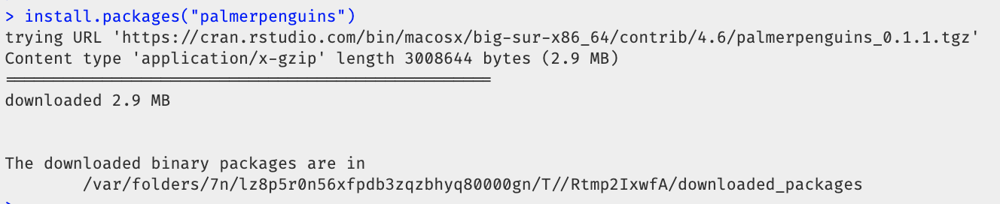
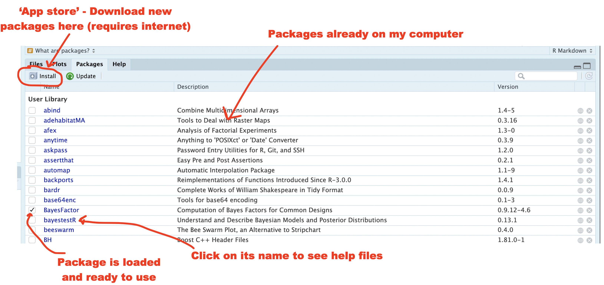
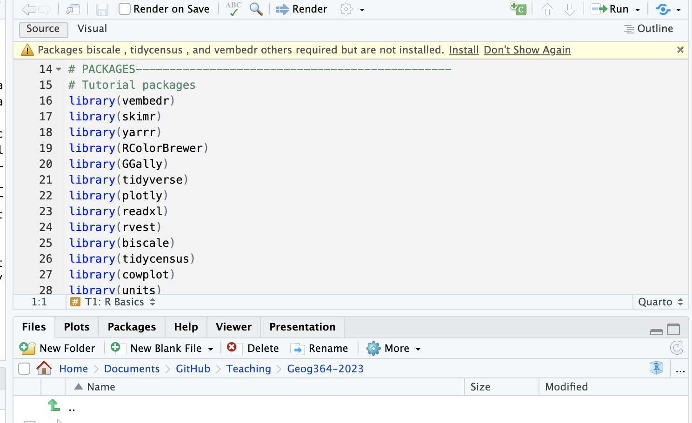
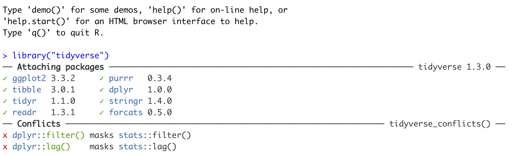

```{r setup, include=FALSE,message=FALSE,warning=FALSE}
# OPTIONS -----------------------------------------------
knitr::opts_chunk$set(echo = TRUE, 
                      warning=FALSE, 
                      message = FALSE)

# Tutorial packages
library(vembedr)
library(skimr)
library(yarrr)
library(RColorBrewer)
library(GGally) 
library(tidyverse)
library(plotly)
library(readxl)
library(rvest)
library(biscale)
library(tidycensus)
library(cowplot)
library(units)


```

# Libraries/Packages {#T2_Libraries}

## IMPORTANT TAKE AWAY

**'Packages' are like apps for R.** They add new functions and datasets that R can make use of. Read more about what they are here: [What are packages](#T2_Libraries_about)

**There are two things you need to know:**

1.  **INSTALL ONCE:** Just like a phone app, you only need to go to the app-store *once* to install the package onto your computer. There are several ways of doing this - see the [installing package tutorial](#T2_Libraries_install) for details.

2.  **LOAD EACH R SESSION USING `library()`:** Like a phone app, even if you've downloaded a package from the app store, you can't access the commands inside a package before you open it! The `library()` command loads/opens packages. See the [loading packages tutorial](#T2_Libraries_load) for more.

    Just like you need to reopen apps after you restart your phone (but you don't need to go to app store), **you need to run your [library]{.underline} commands EVERY TIME YOU RESTART R or your code won't work, but you don't need to re-install the packages.**

**Stuck?** See here for some common problems and solutions: [Package problem](#T2_packageproblems)

<br>

------------------------------------------------------------------------

<br>

## What are packages? {#T2_Libraries_about}

Base-R comes with many pre-built commands (functions) and datasets. These are grouped together into collections called `packages` (sometimes informally called libraries). **You can think of them as apps for R.**

For example:

- `ggplot2` contains functions (commands) for making plots.

- `sf` contains functions (commands) for working with spatial data.

- `bardr` contains the complete works of Shakespeare!

<br>

**Just as your phone comes with the flashlight and calculator pre-installed, R comes with several basic packages.** But... most people also download additional phone apps from the app store. There are millions of phone apps now available, from banking, to social media, to calendars and games.

- *It would be impossible to have every app in the world installed on your phone. Instead, you download the apps that you think you will need from the app-store (occasionally downloading a new one on the fly).*

- *I'm guessing you also don't have every app on your phone running at the same time. When you need to use an app, you click on the button to open and use it.*

<br>

R is exactly the same. **There are thousands of packages available online, but we only install the ones we want, then open/use them when needed.**

- *You have access to tens of thousands of packages in R.* Here's the full list of packages available through the official R package repository, CRAN: <https://cran.r-project.org/web/packages/available_packages_by_name.html>. From doing Bayesian analyses to making interactive maps, there's a package available for you.

- This is far too many to store on your computer, so most live on the internet in an online (free) "Package Store". You can install the ones you want, ready for use at a later date.

- You also don't need to open every package when you use R. Instead, you only load the ones you need in that particular session/lab.

<br>

**So, to access the commands in a package we need two steps:**

1.  **ONCE ONLY: Download and install the package from the online package-store**

2.  **EVERY TIME YOU RESTART R: Load the packages you want**

This tutorial takes you through these steps and a few other more advanced features of packages.

<br>

------------------------------------------------------------------------

<br>

## Installing new packages {#T2_Libraries_install}

There are a few different ways you can install a new package (see below)

**How will you know it's worked?** You will see something like this appear in your console. In this output, cran.rstudio is the web address of the app store and it gets stored in the R folder on your computer.

```{r,im-T2-Installtext, echo=FALSE, out.width="100%",fig.align='center'}

```

### Ways to install packages

#### 1. Click the "Install" (app-store) button in the Packages menu

Look for the quadrant with the packages tab in it.

- You will see a list of packages/apps that have already been installed.
- Click the INSTALL button in the Packages tab menu (on the left - see figure above)
- Start typing the package name and it will show up (check the include dependencies box). Install the package.

```{r,im-T2-Packages1, echo=FALSE, out.width="100%",fig.align='center'}

```

<br>

#### 2. Look for the little yellow banner/ribbon

R will sometimes tell you that you are missing a package (sometimes a little yellow ribbon), normally when you save your code.

This is the easiest way to get the packages you need! Click install to get them!

```{r, im-T2-yellowbanner, echo=FALSE, fig.align='center',out.width="100%"}

```

<br>

#### 3. Type the install command into the CONSOLE

You can also install a package by typing the "app-store" command into the console.

This is `install.packages()`, where you put the name of the package you want to install in quotes. For example, this command will install the `palmerpenguins` package (a teaching dataset on penguins).

```{r, eval=FALSE}
install.packages("palmerpenguins")
```

[**IMPORTANT!**]{.underline} **NEVER put the install.packages() command into your script or markdown report**. Otherwise you force the computer to revisit the app store, which sometimes crashes R and is generally bad form. Instead, always go to the app-store manually or type this command into R.

<br>

## Loading/using packages {#T2_Libraries_load}

Just as going to the app store doesn't check your credit-card balance or make an Instagram post, simply *downloading* a package from the app-store doesn't make the commands available. For that you need to load it (just as you click on a phone app to open it).

**I will tell you which packages you need for each lab, but if R tells you it wants a package at any point, please install it AND load it.**

This can be done with the `library()` command.

For example, here's how to load the `palmerpenguins` package (which contains the Palmer Penguins teaching dataset (<https://www.rdocumentation.org/packages/palmerpenguins/versions/0.1.1>). \

```{r, eval=FALSE}
library(palmerpenguins)
```

*Remember, if you want to try this yourself, you first install the palmerpenguins package using the instructions above.*

<br>

------------------------------------------------------------------------

<br>

## Advanced: Forcing R to use a package (::) {#T2_singlecommand}

Sometimes several packages name a command the same word and you want to specify which package you want to use.

You can do this using the :: symbol. For example, many different packages have a command called filter and R can get confused about which one to use.

This command *forces* the computer to use the 'dplyr package' version of the filter command.

```{r, eval=FALSE}
dplyr::filter(mydata)
```

<br>

------------------------------------------------------------------------

<br>

## Seeing what packages you already have

Some packages are downloaded on your computer by default (just like the flashlight or calculator app on your phone). You can see your current list of downloaded packages in the Package tab.

```{r,im-T2-Packages2, echo=FALSE, out.width="100%",fig.align='center'}

```

<br>

------------------------------------------------------------------------

<br>

## Package Problem Solving {#T2_packageproblems}

### Installation

#### Why isn't my package downloading? R is frozen

Sometimes R will ask you if you want to install binaries or other things. IT WILL ASK YOU THIS QUESTION THROUGH "SPEAKING" IN THE CONSOLE. It expects you to type yes or no, and to press enter to continue. Try yes, if it doesn't work (esp xfun), try no.

<br>

#### R keeps asking to restart.

Sometimes R-Studio might want to restart when downloading packages and occasionally gets confused. If it keeps asking, press cancel, then go to the Session menu at the VERY top, click Restart R and Clear output, reopen and try again.

<br>

### Loading packages

#### Nothing happened when I ran the library command!

If you have managed to load a package successfully, often nothing happens - this is great! It means it loaded the package without errors.

#### There was a load of text output - an error?

Hard to tell. So I suggest running the library command TWICE! This is because many packages will print "friendly messages" or "welcome text" the first time you load them.

For example, this is what shows up when you install the tidyverse package. The welcome text is indicating the sub-packages that tidyverse downloaded and also that some commands now have a different meaning.

```{r, im-T2-friendlytext, echo=FALSE, fig.cap = "Tidyverse install messages",fig.align='center',out.width="100%"}

```

**To find out if what you are seeing is a friendly message or an error, run the command again. If you run it a second time and and nothing happens then you're fine.**

<br>
