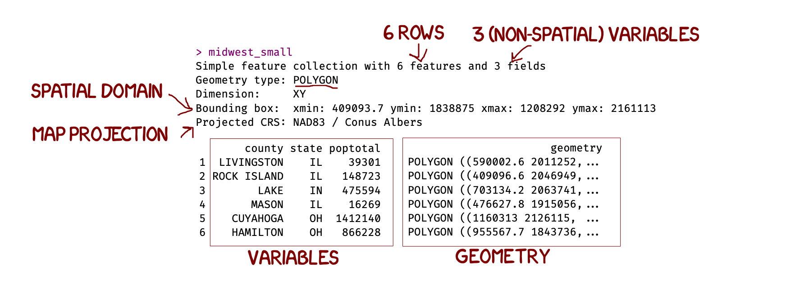

```{r setup, include=FALSE,message=FALSE,warning=FALSE}
# OPTIONS -----------------------------------------------
knitr::opts_chunk$set(echo = TRUE, 
                      warning=FALSE, 
                      message = FALSE)

# Tutorial packages
library(tidyverse)
library(readxl)
library(sf)
library(tmap)

data(midwest)

options(tigris_use_cache = TRUE)

# get county polygons for the 5 Midwest states
counties_sf <- counties(
  state = c("IL", "IN", "MI", "OH", "WI"),
  cb = TRUE,
  class = "sf"
)

# clean the midwest data
midwest2 <- midwest %>%
  mutate(
    state_join = str_to_upper(state),
    county_join = str_to_lower(county) %>%
      str_replace_all("[[:space:][:punct:]]", "")
  )

# clean the tigris county names in the same way
counties_sf2 <- counties_sf %>%
  mutate(
    state_join = STUSPS,
    county_join = str_to_lower(NAME) %>%
      str_replace_all("[[:space:][:punct:]]", "")
  )

# join
midwest_sf <- counties_sf2 %>%
  inner_join(midwest2, by = c("state_join", "county_join"))

# set projection and fix errors (albers)
midwest_sf <- midwest_sf %>%
  st_transform(5070) %>%
  filter(!st_is_empty(geometry)) %>%
  st_make_valid()


# tidy
rm(midwest)
rm(counties_sf2)
rm(midwest2)
rm(counties_sf)
rm(midwest_states)

midwest_small <- dplyr::select(midwest_sf,c("county","state","poptotal"))
midwest_small <- midwest_small[1:6,]
```

# Spatial data  {#T5_VectorSpatial}

<br>

## Spatial data basics {#T5_WhatIsSpatial}

Spatial data analysis is the process of examining the locations, attributes, patterns and spatial relationships of data to address a question or gain useful knowledge (AtoZ GIS Dictionary 2025). In order to do this in R, we first need to teach it about the spatial properties of our data.

There are two main ways of representing spatial data:

- **Vector data:** Each object (row) is represented as a spatial object (a point, line or polygon), that has its own location and spatial properties. For example, the locations of trees might be represented as points, a road network as lines, and building footprints as polygons.
- **Raster data:** The spatial domain is divided into grid of cells. Each cell stores a value of the characteristic you care about. This is especially useful for datasets you can measure 'anywhere' such as elevation or temperature.

**A Geographic Information System** is a piece of software used to create, manage, visualize and analyze data and its spatial counterpart. Most datasets encountered in practice can be associated with a location, whether on the Earth’s surface or within some arbitrary coordinate system such as a soccer field or a gridded petri dish.

<br><br>


## Vector Data using sf {#T5_sfobjects}

For vector work we will use the `sf` package. An `sf` object behaves very much like an ordinary data frame: each row is one object and the ordinary columns contain its variables. The difference is that an `sf` object also has a special `geometry column` which stores the spatial information for each row.

For example, a point dataset might conceptually look like this:

| Station | Temperature | Elevation | geometry |
|---------|-------------|-----------|----------|
| A | 21.3 | 350 | POINT (...) |
| B | 19.8 | 510 | POINT (...) |
| C | 22.1 | 280 | POINT (...) |

The first three columns are ordinary variables. The `geometry` column tells R where each station is located.

Spatial data also needs a **Coordinate Reference System (CRS)**. The CRS tells R what the coordinates mean and how they relate to locations in your domain.  For example, the coordinates might be longitude/latitude in degrees, or projected x/y coordinates measured in metres.

### Exploring sf data

To look at the properties of spatial data, simply type its name into the console. 

```{r Tut12_sfbasics, echo=FALSE, fig.cap='sf basics in R',fig.align='center',out.width="100%"}

```

You can also ask directly for the geometry type or the details of the map projection. In the example above I would type

```{r}
st_geometry(midwest_small)
```


```{r, eval=FALSE}

st_crs(midwest_small)

```

<br><br>


<br><br>


## Turning a normal table into spatial data — `st_as_sf()` {#T5_st_as_sf}

Sometimes your data starts as an ordinary spreadsheet containing longitude and latitude columns. R can see those columns, but at the moment it just sees them as numbers. We need to tell R that they describe locations.

First read the spreadsheet normally:

```{r, eval=FALSE}
points_table <- read_excel("points.xlsx")
```

Look at the data and check the exact names of the coordinate columns:

```{r, eval=FALSE}
names(points_table)
head(points_table)
```

Suppose they are called `longitude` and `latitude`. Use `st_as_sf()` to create a spatial version:

```{r, eval=FALSE}
points <- points_table |>
  st_as_sf(coords = c("longitude", "latitude"),
           crs = 4326)
```

There are three important pieces here:

- `points_table` is the original table.
- `coords = c("longitude", "latitude")` tells R which columns contain the **x and y coordinates**. Longitude is x, so it comes first. Latitude is y, so it comes second.
- `crs = 4326` tells R what coordinate system those numbers are already using. EPSG:4326 is WGS 84 longitude/latitude.

> **Important:** `st_as_sf()` does not work out the CRS from the coordinate values. You need to know what coordinate system the original data uses. Only use `crs = 4326` when your coordinates really are WGS 84 longitude/latitude.

Now look at the new object:

```{r, eval=FALSE}
points
```

or open it as a table:

```{r, eval=FALSE}
View(points)
```

By default, the original longitude and latitude columns have disappeared and been replaced by a `geometry` column. The coordinates have not been lost: they are now stored inside each point geometry.

If you want to keep the original coordinate columns as well, add `remove = FALSE`:

```{r, eval=FALSE}
points <- points_table |>
  st_as_sf(coords = c("longitude", "latitude"),
           crs = 4326,
           remove = FALSE)
```

<br>

------------------------------------------------------------------------

## Reading data that is already spatial — `st_read()` {#T5_st_read}

Some files are already spatial vector datasets. Common examples include shapefiles (`.shp`), GeoJSON files (`.geojson`) and GeoPackages (`.gpkg`).

In this case the geometry is already stored in the file, so you do **not** need `st_as_sf()`. Read it directly using `st_read()`:

```{r, eval=FALSE}
areas <- st_read("areas.gpkg")
```

or:

```{r, eval=FALSE}
areas <- st_read("areas.shp")
```

`areas` should now already be an `sf` object, with a geometry column and, if the file contains it, a CRS.

<br>

------------------------------------------------------------------------

## Checking your spatial data {#T5_CheckSpatial}

It is worth checking spatial data immediately after you create or read it. Start by typing the object name, then check its geometry, CRS and bounding box:

```{r, eval=FALSE}
points

st_geometry_type(points)
st_crs(points)
st_bbox(points)
```

`st_geometry_type()` tells you whether your objects are points, lines, polygons etc.

`st_crs()` tells you the Coordinate Reference System.

`st_bbox()` gives the minimum and maximum x and y coordinates for the whole dataset. This is a quick way to find obvious problems: one incorrect coordinate can make your map stretch across half the world.

A quick map is also one of the best checks. We will use `qtm()` for this below.

<br>

------------------------------------------------------------------------

## Coordinate Reference Systems {#T5_CRS}

Coordinates only make sense if we know what they mean. A value of `40.8` could be a latitude in degrees; a value of `500000` might be an easting measured in metres. The **CRS** stores the information R needs to interpret those coordinates correctly.

Many common coordinate reference systems have an **EPSG code**. For example, EPSG:4326 is WGS 84 longitude/latitude, measured in degrees. Projected CRSs commonly use x/y coordinates measured in metres.

When you work with several spatial layers, they may arrive in different coordinate systems. Check them using:

```{r, eval=FALSE}
st_crs(points)
st_crs(areas)
```

For spatial analysis it is usually easiest to put them into the same CRS. `st_transform()` converts the coordinates into a new coordinate system.

For example, make the points use the same CRS as the polygon data:

```{r, eval=FALSE}
points <- points |>
  st_transform(st_crs(areas))
```

The points have not moved in the real world. R has recalculated their coordinates so that the two datasets describe locations using the same coordinate system.

> **Important:** Use `st_transform()` when you want to reproject data. Simply replacing the CRS label does not convert the coordinates.

<br>

------------------------------------------------------------------------

# Basic wrangling with `sf` {#T5_SFWrangling}

An `sf` object is still a data frame, so most of the `dplyr` commands you already use work in the usual way. The geometry stays attached to the correct row as you filter, select or mutate the data.

<br>

## Filtering using a variable — `filter()` {#T5_filter}

For example, keep only active sites:

```{r, eval=FALSE}
active_points <- points |>
  filter(status == "Active")
```

Or remove one known bad observation:

```{r, eval=FALSE}
points <- points |>
  filter(site_id != "BAD_SITE")
```

The rows are filtered and their geometries go with them.

<br>

## Selecting variables — `select()` {#T5_select}

You can keep only the variables you need:

```{r, eval=FALSE}
points_small <- points |>
  select(site_id, status, temperature)
```

You may notice that the geometry column is still there even though you did not list it. This is deliberate. In an `sf` object the geometry column is **sticky**, so `select()` keeps it automatically.

If you genuinely want to remove the spatial information and return to an ordinary data frame, use:

```{r, eval=FALSE}
points_table <- points |>
  st_drop_geometry()
```

<br>

## Creating or changing variables — `mutate()` {#T5_mutate}

`mutate()` also works normally. For example:

```{r, eval=FALSE}
points <- points |>
  mutate(temp_f = temperature * 9/5 + 32)
```

The geometry is unchanged.

<br>

------------------------------------------------------------------------

## Filtering using location — `st_filter()` {#T5_st_filter}

There is an important difference between **filtering by a variable** and **filtering by location**.

`filter()` asks a question about the attributes in the table:

```{r, eval=FALSE}
points |>
  filter(temperature > 20)
```

`st_filter()` asks a spatial question using the geometry. For example, if `areas` contains your study-area polygon, this keeps only points that intersect that area:

```{r, eval=FALSE}
points_in_area <- points |>
  st_filter(areas)
```

A useful way to remember the difference is:

- `filter()` = **which rows have the attribute values I want?**
- `st_filter()` = **which spatial objects are in the location I want?**

`st_filter()` keeps the variables from `points`; `areas` is being used to decide which point rows should remain.

<br>

## Adding information using location — `st_join()` {#T5_st_join}

Sometimes you do not want to remove points. Instead, you want to add information from the polygon each point falls in.

For example, if `areas` contains county polygons, a spatial join can attach the appropriate county information to each point:

```{r, eval=FALSE}
points_with_area <- points |>
  st_join(areas)
```

The result still contains point geometry, but it now also contains variables copied from the matching polygon.

So:

- `st_filter()` uses another layer to decide **which objects to keep**.
- `st_join()` uses another layer to decide **which information to add**.

<br>

------------------------------------------------------------------------

# Mapping vector data with `tmap` {#T5_tmap}

`tmap` is designed to work directly with spatial objects such as `sf` data. It can make both quick exploratory maps and more carefully constructed maps.

We will start with `qtm()` and then move to the full layer-based syntax.

<br>

## Quick maps — `qtm()` {#T5_qtm}

`qtm()` stands for **quick thematic map**. It is useful when you simply want to check where your data is or quickly look at a variable.

```{r, eval=FALSE}
qtm(points)
```

If the points appear in the wrong country, or the map zooms out across a huge area, stop here and check your coordinates and CRS.

You can also map one of the variables in the dataset:

```{r, eval=FALSE}
qtm(points, fill = "temperature")
```

For polygon data:

```{r, eval=FALSE}
qtm(areas, fill = "population")
```

Here `fill` tells `tmap` which variable should control the fill colour of the symbols or polygons.

<br>

------------------------------------------------------------------------

## Static or interactive maps — `tmap_mode()` {#T5_tmapmode}

`tmap` has two main modes.

Use `plot` for a static map suitable for a report or PDF:

```{r, eval=FALSE}
tmap_mode("plot")
qtm(points, fill = "temperature")
```

Use `view` for an interactive map that you can pan and zoom:

```{r, eval=FALSE}
tmap_mode("view")
qtm(points, fill = "temperature")
```

Interactive `view` mode can also use web basemaps, which is useful for checking your data against roads, buildings and other landmarks.

<br>

------------------------------------------------------------------------

# Building a `tmap` using layers {#T5_tmaplayers}

`qtm()` is excellent for a quick look. For a map where you want more control, build it using layers.

The basic structure is:

```{r, eval=FALSE}
tm_shape(SPATIAL_DATA) +
  tm_LAYER()
```

`tm_shape()` tells `tmap` **which spatial dataset to use**. The next command tells it **how to draw that dataset**.

For example:

```{r, eval=FALSE}
tm_shape(points) +
  tm_dots()
```

The `+` means that we are adding another piece to the map.

<br>

## Points — `tm_dots()` and `tm_symbols()` {#T5_tm_points}

For simple points, use `tm_dots()`:

```{r, eval=FALSE}
tm_shape(points) +
  tm_dots(fill = "status")
```

If you also want a variable to control symbol size, use `tm_symbols()`:

```{r, eval=FALSE}
tm_shape(points) +
  tm_symbols(fill = "status",
             size = "population")
```

<br>

## Polygons — `tm_polygons()` {#T5_tm_polygons}

For polygon data:

```{r, eval=FALSE}
tm_shape(areas) +
  tm_polygons(fill = "population")
```

`tm_polygons()` draws both the polygon fill and the borders. If you want separate control over them, use `tm_fill()` and `tm_borders()`:

```{r, eval=FALSE}
tm_shape(areas) +
  tm_fill(fill = "population") +
  tm_borders()
```

<br>

## Lines — `tm_lines()` {#T5_tm_lines}

For roads, rivers, routes or other line data:

```{r, eval=FALSE}
tm_shape(roads) +
  tm_lines(col = "road_type")
```

<br>

------------------------------------------------------------------------

## Putting several spatial layers on one map {#T5_MultipleLayers}

Most GIS maps contain more than one spatial dataset. Add another `tm_shape()` whenever you want to switch to a different dataset.

For example, draw polygons first and points on top:

```{r, eval=FALSE}
tm_shape(areas) +
  tm_polygons(fill = "population") +

  tm_shape(points) +
  tm_dots(fill = "status")
```

`tmap` draws the layers in the order you add them, so the points appear on top of the polygons here.

<br>

## Adding a basemap {#T5_Basemap}

A basemap gives your spatial data geographic context. This is most useful in interactive `view` mode.

```{r, eval=FALSE}
tmap_mode("view")

tm_shape(areas) +
  tm_borders() +

  tm_shape(points) +
  tm_dots(fill = "status") +

  tm_basemap("OpenStreetMap")
```

The basemap is the background map. Your `points` and `areas` objects are still the spatial data you are analysing.

<br>

## Labels and other map components {#T5_Labels}

Use `tm_text()` to label objects using one of their variables:

```{r, eval=FALSE}
tm_shape(areas) +
  tm_borders() +
  tm_text(text = "name")
```

You can also add components such as a title or scale bar:

```{r, eval=FALSE}
tm_shape(areas) +
  tm_polygons(fill = "population") +
  tm_title("Population") +
  tm_scalebar()
```

<br>

------------------------------------------------------------------------

## Common `tmap` commands {#T5_CommonLayers}

| What you want to draw | Common `tmap` command        |
|-----------------------|------------------------------|
| Points                | `tm_dots()` / `tm_symbols()` |
| Lines                 | `tm_lines()`                 |
| Polygons              | `tm_polygons()`              |
| Polygon fill only     | `tm_fill()`                  |
| Polygon borders only  | `tm_borders()`               |
| Raster                | `tm_raster()`                |
| Text labels           | `tm_text()`                  |
| Web basemap           | `tm_basemap()`               |
| Map title             | `tm_title()`                 |
| Scale bar             | `tm_scalebar()`              |

The pattern is always the same: choose a dataset with `tm_shape()`, then add layers or map components with `+`.

<br>

------------------------------------------------------------------------

## Troubleshooting {#T5_SpatialTroubleshooting}

**My points appear in completely the wrong place.** Check that your x and y columns were supplied in the correct order. For longitude/latitude data, longitude is x and latitude is y. Then check the CRS.

```{r, eval=FALSE}
st_crs(points)
st_bbox(points)
```

<br>

**My map is blank or zoomed out across a huge area.** Check `st_bbox()`. One bad coordinate can make the map extent enormous.

<br>

**Two spatial datasets will not work together.** Check both CRSs. If they differ, transform one to match the other before doing spatial analysis.

```{r, eval=FALSE}
points <- points |>
  st_transform(st_crs(areas))
```

<br>

<br>

**I used `filter()` when I meant “keep points inside this polygon.”** `filter()` works on attribute values. Use `st_filter()` when the condition depends on spatial location.

<br>

------------------------------------------------------------------------

## Main commands in one place {#T5_Summary}

```{r, eval=FALSE}
# READ AN ORDINARY TABLE --------------------------------
points_table <- read_excel("points.xlsx")

# MAKE IT SPATIAL ---------------------------------------
points <- points_table |>
  st_as_sf(coords = c("longitude", "latitude"),
           crs = 4326)

# READ AN EXISTING SPATIAL FILE -------------------------
areas <- st_read("areas.gpkg")

# CHECK THE SPATIAL INFORMATION -------------------------
st_geometry_type(points)
st_crs(points)
st_bbox(points)

# MAKE TWO LAYERS USE THE SAME CRS ----------------------
points <- points |>
  st_transform(st_crs(areas))

# NORMAL DATA WRANGLING ---------------------------------
points <- points |>
  filter(status == "Active") |>
  select(site_id, status, temperature) |>
  mutate(temp_f = temperature * 9/5 + 32)

# FILTER USING LOCATION ---------------------------------
points_in_area <- points |>
  st_filter(areas)

# QUICK MAP ---------------------------------------------
tmap_mode("view")
qtm(points, fill = "temperature")

# LAYERED MAP -------------------------------------------
tm_shape(areas) +
  tm_borders() +

  tm_shape(points) +
  tm_dots(fill = "temperature") +

  tm_basemap("OpenStreetMap")
```
