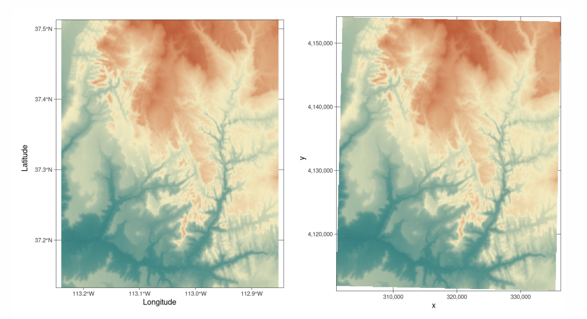
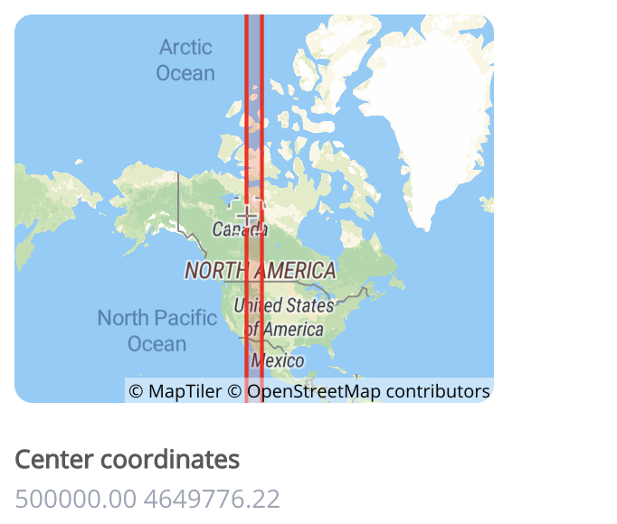

```{r setup, include=FALSE,message=FALSE,warning=FALSE}
# OPTIONS -----------------------------------------------
knitr::opts_chunk$set(echo = TRUE, 
                      warning=FALSE, 
                      message = FALSE)

# Tutorial packages
library(tidyverse)
library(readxl)
library(sf)
library(tmap)
library(tigris)
library(tidycensus)


options(tigris_use_cache = TRUE)

```

```{r medical,eval=FALSE, include=FALSE,message=FALSE,warning=FALSE}


medicaldata <- read_excel("MedicalClinics.xlsx")

medicaldata_sf <- st_as_sf(medicaldata, 
                           coords=c("Longggitude","latitudE"),
                           crs=4326)

population <- get_acs(
  geography = "tract",
  state = c("LA", "MS", "AR"),
  variables = c(population = "B01003_001"),
  year = 2024,
  geometry = TRUE,
  keep_geo_vars = TRUE
) |>
  mutate(
    pop_density = estimate / (ALAND / 2589988.11)
  )

broadband <- get_acs(
  geography = "tract",
  state = c("LA", "MS", "AR"),
  variables = c(broadband = "B28002_001"),
  summary_var = "B01003_001",
  year = 2024,
  survey = "acs5",
  geometry = TRUE,
  keep_geo_vars = TRUE
) |>
  mutate(
    broadband_prop = estimate / summary_est
  )

medicaldata_sf <- st_transform(medicaldata_sf, st_crs(population))


#gpkg
population_locations <- st_crop(population, medicaldata_sf)
population_locations <- population_locations |>
  select(
    GEOID,
    Name = NAMELSADCO,
    State = STATE_NAME,
    Population = estimate,
    Pop_density = pop_density
  )
st_write(
  population_locations,
  "medical_population_density.gpkg",
  layer = "acs_pop_density", append=FALSE)


#shp
broadband_locations <- st_crop(broadband, medicaldata_sf)
broadband_locations <- broadband_locations |>
  select(
    GEOID,
    Name = NAMELSADCO,
    State = STATE_NAME,
    Tot_house = summary_est,
    Broadband = estimate,
    Broadband_pct = broadband_prop
  )

st_write(
  broadband_locations,
  "medical_broadband.shp",
  layer = "acs_broadband", append=FALSE)


(rm(list=ls()))


```

# Spatial data {#T5_VectorSpatial}

<br>

## Example datasets

Throughout this tutorial, I will be using a dataset of medical clinics. You are welcome to download it yourself if you want to follow along by clicking here.

- Medical clinics: MedicalClinics.xlsx
- Population Density: medical_population.gpkg
- Broadband: medical_broadband.zip

## Useful tutorials

- <https://ourcodingclub.github.io/tutorials/spatial-vector-sf/>
- <https://github.com/rstudio/cheatsheets/blob/main/sf.pdf>
- <https://learning.nceas.ucsb.edu/2020-02-RRCourse/spatial-vector-analysis-using-sf.html>

<br>

## Spatial data basics {#T5_WhatIsSpatial}

Geographical data needs special treatment. As well as standard data analysis, we need to tell R that our data has a spatial location on the Earth's surface. R needs to understand what units our spatial location is in (e.g. metres, degrees..) and how we want the data to appear on plots and maps. R also needs to understand the different types of vector data (e.g. what we mean by a "polygon" or "point").

To achieve this there are some specialist types of data we need to use and several spatial data packages.

1.  **Vector data mostly uses the `sf` package**. Each object (row) is represented as a spatial object (a point, line or polygon). For example the locations of trees might be represented as points, a road network as lines, and building footprints as polygons.

2.  **Raster data mostly uses the `terra` package** The spatial domain is divided into a grid of equally sized cells. These are useful for storing field data that varies continuously over space, such as a satellite image, temperature or an elevation surface.

We're going to split this tutorial by vector and raster (field) data

<br>

### Map projections

See here for a great overview: <https://source.opennews.org/articles/choosing-right-map-projection/>

At its simplest, think of our map projections as the "units" of the x-y-z coordinates of geographic data. For example, here is the same map, but in two different projections.

- On the left, the figure is in latitiude/longitude in units of degrees. LOOK AT THE UNITS ON THE AXIS!

- On the right the same map is in UTM.

```{r, Tut11Fig1, echo=FALSE, fig.align='center',out.width="80%",fig.cap="*Examples of geographic coordinate systems for raster data (WGS 84; left, in Lon/Lat degrees) and projected (NAD83 / UTM zone 12N; right, in metres), figure from https://geocompr.robinlovelace.net/spatial-class.html*"}

```

#### The UTM system

In the UTM system, the Earth is divided into 60 zones. Northing values are given by the metres north, or south (in the southern hemisphere) of the equator. Easting values are established as the number of metres from the central meridian of a zone. You can see the UTM zone here

```{r, Tut11Fig2, echo=FALSE, fig.align='center',out.width="45%",fig.cap="Zone 12N: https://epsg.io/32612"}

```

#### EPSG codes

Each map projection has a unique numeric code called an EPSG code. To find them, I tend to use these resources, but in this course I will try to provide the codes

- <https://epsg.io>
- <https://mangomap.com/robertyoung/maps/69585/what-utm-zone-am-i-in->
- ChatGPT and similar

<p class="comment">

**R is stupid. It has no idea what units or projection your coordinates are in until you tell it**

</p>

<br><br>

## Vector Data {#T5_sfobjects}

### How to make existing data "spatial" (`st_as_sf`) {#T5_st_as_sf}

The `sf` package is designed to deal with vector data, but you need to convert your data into `sf` format before its commands will work. Lets read in some non spatial data. These are medical clinics near the LA/MI border.

```{r}
medicaldata <- read_excel("MedicalClinics.xlsx")
head(medicaldata)
```

#### Step 1: Note the column names of your x/y coordinates {.unnumbered}

First, look at your data and note the column names of your x and y coordinates. Note, these don’t have to be fancy spatial names, they can be “elephanT” and “popcorn”. To make my point, I have named my x and y columns "Longggitude" and "latitudE".

You can do this via looking at just the column names with the names command

```{r}
names(medicaldata)

```

or by just looking at the data

```{r}
medicaldata
```

<br>

#### Step 2: Note the coordinate reference system {.unnumbered}

Spatial data also needs a **Coordinate Reference System (CRS)**. The CRS tells R what the coordinates mean and how they relate to locations in your domain. For example, the coordinates might be longitude/latitude in degrees, or projected x/y coordinates measured in metres.

Each of these many thousands of coordinate systems has an "EPSG" reference number assigned to it, and we need that to communicate to R in order to correctly make the data spatial.

[In this class, we are mostly going to be longitude/latitude data in units of degrees with EPSG=4326]{.underline}

But as long as you can identify it, you can work with any form of spatial data. The problem is that you need to note the coordinate system in advance from the help-file/data-documentation. These days, if you have some idea then asking chatGPT/Claude for the related EPSG code will be the fastest way to get it, but there are also many websites that can help such as <https://epsg.io>

<br>

#### Step 3: Make the data spatial {.unnumbered}

Now we have everything needed to make our data spatial.

```{r}
medicaldata_sf <- st_as_sf(medicaldata, 
                           coords=c("Longggitude","latitudE"),
                           crs=4326)
```

In this code:

- **Command:**

  - st_as_sf() from the sf package. It will only work if you have the sf package in your library loading chunk and if you have run that code chunk.

- **Arguments**

  - `medicaldata` is the original table.

  - `coords = c("Longggitude", "latitudE")` tells R the COLUMN NAMES of the **x and y coordinates**. Longitude is x, so it comes first. Latitude is y, so it comes second.

  - coords: These are the COLUMN NAMES of our coordinates. In this case, they are are "Longggitude" and "latitudE" (note the c() and the quote marks)

  - `crs = 4326` tells R what coordinate system those numbers are already using. EPSG:4326 is WGS 84 longitude/latitude.

  - `medicaldata_sf` I tend to name the spatial version the same as the original data but add \_sf at the end.

<br><br>

------------------------------------------------------------------------

### Reading spatial data from file — `st_read()` {#T5_st_read}

There are also many spatial files. Common examples include shapefiles (`.shp`), GeoJSON files (`.geojson`) and GeoPackages (`.gpkg`). In this case the geometry is already stored in the file, so you do **not** need `st_as_sf()`.

To read in spatial files, use the `st_read()` command. This is easy for gpkg and geoson files.

```{r}
population_sf <- st_read("medical_population_density.gpkg")
```

#### Reading in shapefiles

**IMPORTANT**: Shapefiles (.shp) are actually made up of several separate files (for example, .shp, .shx, and .dbf). Keep all of these files together in the same folder, or the shapefile will not open correctly.

You will have downloaded a zipped folder (medical_broadband.zip). Unzip this, but keep all of the shapefile components together in the same folder.

```{r, echo=FALSE}
list.files("./medical_broadband",pattern="broadband")
```

To read the shapefile into R, point st_read() to the .shp file: R will automatically use the other shapefile components stored alongside it.

```{r}
broadband_sf <- st_read("medical_broadband/medical_broadband.shp")

```

<br><br>

### Exploring vector data {#T5_sfexplore}


No matter if you have read the data in from file or converted it, your spatial dataset will appear different to a normal table.

In general, a `sf` object behaves very much like an ordinary data frame: each row is one object and the ordinary columns contain its variables. The difference is that an `sf` object also has a special `geometry column` which stores the spatial information for each row. It also contains meta data about the coordinate system and the bounding box/spatial domain.

For example, a point dataset might conceptually look like this:

| Name | Height | Number of leaves | geometry    |
|------|--------|------------------|-------------|
| A    | 21.3   | 350              | POINT (...) |
| B    | 19.8   | 510              | POINT (...) |
| C    | 22.1   | 280              | POINT (...) |

The first three columns are ordinary variables. The `geometry` column tells R where each station is located. For lines and polygons, the geometry column will also contain information about direction and shape.

Here's how the medical data has changed. R now understands that it's spatial,so typing its name it provides a spatial summary alongside the data itself. This includes things like the bounding box and map projection.

Here is our point data.

```{r}
medicaldata_sf
```

and here is our polygon data for population density

```{r}
population_sf
```

You can also ask directly for the geometry type or the details of the map projection. In the example above I would type

```{r}
st_geometry(medicaldata_sf)
```

and

```{r, eval=FALSE}

# This is what the EPSG=4326 actually means. 
st_crs(medicaldata_sf)

```

<br>

### Keeping the long/lat/coordinate columns

By default, the original longitude and latitude columns have disappeared and been replaced by a `geometry` column. The coordinates have not been lost: they are now stored inside each point geometry.

If you want to keep the original coordinate columns as well, add `remove = FALSE`:

```{r}
medicaldata_sf <- st_as_sf(medicaldata, 
                           coords=c("Longggitude","latitudE"),
                           crs=4326,
                           remove = FALSE)


medicaldata_sf
```

<br><br>

## Making basic maps (qtm) {#T5_qtmmaps}

You can do this by using the qtm command. "quick thematic map". It's in the tmap package so you need that loaded in your top code chunk before this will work. 

To make a quick map of a spatial dataset, all I do is say qtm(DataName). For example for the medical data:

```{r}
qtm(medicaldata_sf)
```


I can then add to this by adding a column title and it will color the dots/polygons by that column. For example, lets say I wanted to look at the population density column of population_sf

```{r}
qtm(population_sf, "Pop_density")
```


Even more interestingly, you can make the map interactive by adding tmap_mode("view") before the qtm code. In this mode, someone can change the basemap and zoom in and out.

```{r}
tmap_mode("view")
qtm(medicaldata_sf , size=.5)
```


There are MANY more features in the qtm help file (?qtm), but to go to the next level with making maps, we need to use the full tmap package (next week)


